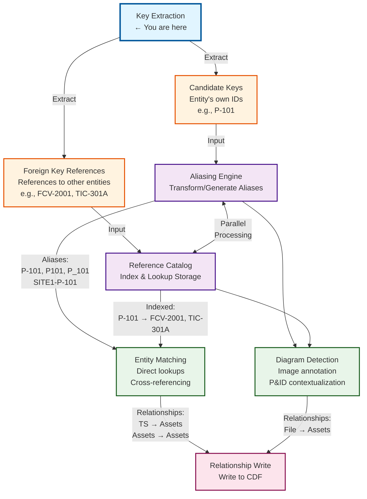

# Key Extraction

Key extraction is the foundational process of identifying and extracting asset tags, equipment identifiers, and document file names from metadata attributes within Cognite Data Fusion (CDF). This process transforms unstructured or semi-structured text data into structured, queryable identifiers that enable downstream contextualization and aliasing workflows.

## TLDR

**What it does**: Extracts structured identifiers (asset tags, document names, equipment IDs) from unstructured metadata fields like descriptions, names, and comments.

**Key outputs**:
- ✅ **Candidate keys** - Entity's own identifiers (`P-101`, `FCV-2001A`)
- ✅ **Foreign key references** - References to other entities (`FCV-2001` → `P-101`)
- ✅ **Document references** - Engineering drawing names (`P&ID-2001-Rev-C`)

**Key Definitions**:
- **Candidate Key**: A field or combination of fields that can uniquely identify a record within a dataset. In asset management, these are natural identifiers like equipment tags (`P-101`) or instrument tags (`FIC-2001`) that uniquely identify specific equipment or instruments.
- **Foreign Key Reference**: A reference to another entity's candidate key found within metadata. For example, a time series might reference `FCV-2001` (a valve) in its description, creating a foreign key reference from the time series to the valve entity.

**4 extraction methods**:
1. **Regex** - Pattern matching (`P-\d+` for `P-101`, `P-102`)
2. **Fixed width** - Position-based parsing (`chars 1-3: site, chars 4-7: tag`)
3. **Token reassembly** - Split, validate, reassemble tokens
4. **Heuristic** - ML/statistical methods for inconsistent data

**Quick start**:
```yaml
extraction_rules:
  - name: "asset_tags"
    source_fields: ["name", "description"]
    method: "regex"
    pattern: '[A-Z]+-\d+[A-Z]?'
    output_type: "candidate_key"
```

**Common patterns**:
- Asset tags: `P-101`, `FCV-2001A`, `TIC-301`
- Document names: `P&ID-2001-Rev-C`, `DWG-123-Sheet-1`
- Time series: `P-101-FLOW`, `T-50-TEMP`

**When to use**: First step in any CDF contextualization pipeline - extracts the identifiers needed for entity matching and relationship building.

## Table of Contents

- [Purpose](#purpose)
- [Key Extraction Workflow](#key-extraction-workflow)
- [Configuration](#configuration)
  - [Core Configuration Properties](#core-configuration-properties)
  - [Source View](#source-view)
  - [Source Field(s)](#source-fields)
  - [Method](#method)
    - [Regex](#regex)
    - [Fixed Width Parsing](#fixed-width-parsing)
    - [Token Reassembly](#token-reassembly)
    - [Heuristic](#heuristic)
- [Confidence score calculation by method](#confidence-score-calculation-by-method)
- [Best Practices](#best-practices)
  - [Rule Priority and Ordering](#rule-priority-and-ordering)
  - [Performance Optimization](#performance-optimization)
  - [Error Handling](#error-handling)
  - [Testing and Validation](#testing-and-validation)
- [Troubleshooting](#troubleshooting)
  - [Common Issues](#common-issues)
  - [Debugging](#debugging)
- [Additional Resources](#additional-resources)

## Purpose

The key extraction process serves several critical functions:

- **Asset Tag Identification**: Extract equipment tags (e.g., P-101, FCV-2001A) from asset metadata fields
- **Document Reference Extraction**: Identify engineering document names (e.g., P&ID-2001-Rev-C) from file metadata
- **Time Series Tag Mapping**: Parse time series external IDs to extract asset references and measurement types
- **Foreign Key Discovery**: Build a reference catalog of relationships between entities based on extracted keys
- **Contextualization Foundation**: Provide clean, standardized identifiers for downstream entity matching and linking

### Key Concepts

#### Candidate Keys
A **candidate key** is a field or combination of fields that can uniquely identify a record within a dataset. In the context of industrial asset management:

- **Equipment Tags**: Primary identifiers for physical equipment (e.g., `P-101` for Pump 101, `V-201` for Valve 201)
- **Instrument Tags**: Identifiers for measurement and control instruments (e.g., `FIC-2001` for Flow Indicator Controller 2001, `TIC-301` for Temperature Indicator Controller 301)
- **Document Names**: Unique identifiers for engineering documents (e.g., `P&ID-2001-Rev-C` for Piping and Instrumentation Diagram 2001 Revision C)

**Characteristics of Candidate Keys**:
- **Uniqueness**: Each candidate key must uniquely identify one and only one entity
- **Natural Identifiers**: These are meaningful identifiers used in the real world, not artificial database keys
- **Industry Standards**: Often follow industry naming conventions (ISA-5.1 for instrumentation, company-specific for equipment)

#### Foreign Key References
A **foreign key reference** is a reference to another entity's candidate key found within metadata. These references establish relationships between entities:

- **Time Series → Equipment**: A flow measurement time series might reference `P-101` in its description, indicating it measures flow from Pump 101
- **Document → Equipment**: A maintenance work order might reference `FCV-2001` in its description, indicating work on Flow Control Valve 2001
- **Equipment → Equipment**: A pump's metadata might reference `T-301` (Tank 301) indicating it pumps from that tank

**Characteristics of Foreign Key References**:
- **Relationship Building**: Enable creation of relationships between different entity types
- **Contextual Information**: Provide context about how entities relate to each other
- **Cross-Entity Linking**: Allow linking of assets, documents, time series, and other entity types

#### Example: Candidate Key vs Foreign Key Reference

```python
# Asset Entity (Pump P-101)
asset = {
    "name": "P-101",
    "description": "Main feed pump for Tank T-301",
    "type": "pump"
}
# Candidate Key: "P-101" (uniquely identifies this pump)
# Foreign Key Reference: "T-301" (references Tank T-301)

# Time Series Entity (Flow measurement)
timeseries = {
    "externalId": "P-101-FLOW",
    "description": "Flow measurement for pump P-101",
    "unit": "m³/h"
}
# Candidate Key: "P-101-FLOW" (uniquely identifies this time series)
# Foreign Key Reference: "P-101" (references Pump P-101)

# Document Entity (P&ID)
document = {
    "name": "P&ID-2001-Rev-C",
    "description": "Piping diagram showing pumps P-101, P-102 and valves FCV-2001, FCV-2002",
    "type": "P&ID"
}
# Candidate Key: "P&ID-2001-Rev-C" (uniquely identifies this document)
# Foreign Key References: "P-101", "P-102", "FCV-2001", "FCV-2002" (references multiple equipment)
```

## Key Extraction Workflow

Key extraction is the first step in a larger contextualization pipeline:




*Note: If the diagram above doesn't render, please see the static image at the top of this section.*

## Configuration

The key extraction process is defined through extraction rules that specify what to extract, where to look, and how to extract it. Each extraction rule is configured through a YAML configuration file or programmatically using the `ExtractionRule` data class.

### Core Configuration Properties

```yaml
extraction_rules:
  - name: "standard_pump_tag"
    description: "Extracts standard pump tags from equipment descriptions"
    extraction_type: "asset_tag"
    method: "regex"
    pattern: '\bP[-_]?\d{2,4}[A-Z]?\b'
    priority: 50
    enabled: true
    scope_filters:
      site: ["Plant_A", "Plant_B"]
      unit: ["Unit_100", "Unit_200"]
    min_confidence: 0.7
    case_sensitive: false
    aliasing_rules:
      - type: "character_substitution"
        substitutions:
          "_": "-"
      - type: "prefix_suffix"
        prefix: "SITE1-"
```

#### Configuration Parameters

| Parameter | Type | Description | Example |
|-----------|------|-------------|---------|
| `name` | String | Unique identifier for the rule | `"flow_instrument_tag"` |
| `description` | String | Human-readable explanation of what the rule extracts | `"Extracts ISA flow instruments"` |
| `extraction_type` | Enum | Type of key being extracted: `asset_tag`, `file_name`, `measurement_id` | `"asset_tag"` |
| `method` | String | Extraction method to use | `"regex"`, `"fixed_width"`, `"token_reassembly"`, `"heuristic"` |
| `pattern` | String | Pattern definition (format depends on method) | `'\bFIC[-_]?\d{4}\b'` |
| `priority` | Integer | Rule priority (lower = higher priority) | `50` |
| `enabled` | Boolean | Whether the rule is active | `true` |
| `scope_filters` | Dict | Context filters to apply the rule selectively | `{"site": ["Plant_A"]}` |
| `min_confidence` | Float | Minimum confidence score (0.0-1.0) | `0.7` |
| `case_sensitive` | Boolean | Whether pattern matching is case-sensitive | `false` |
| `aliasing_rules` | List | Transformation rules applied to extracted values | See Aliasing section |

### Source View

The source view defines which CDF data model view(s) to query for entities whose metadata will be processed. This determines the scope of the extraction pipeline.

#### Asset Metadata Extraction

```yaml
source_views:
  - view_external_id: "CogniteEquipment"
    view_space: "sp_enterprise_process_industry"
    view_version: "v1"
    entity_type: "asset"
    batch_size: 100
    filter:
      equals:
        property: ["node", "type"]
        value: "Equipment"
    include_properties:
      - "name"
      - "description"
      - "tagIds"
      - "equipmentType"
      - "specifications"
```

#### File Metadata Extraction

```yaml
source_views:
  - view_external_id: "txFile"
    view_space: "sp_enterprise_process_industry"
    view_version: "v1"
    entity_type: "file"
    batch_size: 50
    filter:
      in:
        property: ["node", "tags"]
        values: ["ToProcess", "EngineeringDrawing"]
    include_properties:
      - "name"
      - "description"
      - "documentType"
      - "drawingNumber"
```

#### Time Series Metadata Extraction

```yaml
source_views:
  - view_external_id: "txTimeSeries"
    view_space: "sp_enterprise_process_industry"
    view_version: "v1"
    entity_type: "timeseries"
    batch_size: 200
    include_properties:
      - "externalId"
      - "name"
      - "description"
      - "unit"
```

#### Source View Parameters

| Parameter | Description | Example |
|-----------|-------------|---------|
| `view_external_id` | External ID of the data model view | `"CogniteEquipment"` |
| `view_space` | Space where the view is defined | `"sp_enterprise_process_industry"` |
| `view_version` | Version of the view schema | `"v1"` |
| `entity_type` | Type of entity for processing context | `"asset"`, `"file"`, `"timeseries"` |
| `batch_size` | Number of entities to process per batch | `100` |
| `filter` | CDF DMS filter to limit query scope | See filter examples above |
| `include_properties` | List of properties to retrieve | `["name", "description"]` |

### Source Field(s)

Source fields specify which metadata attributes to analyze for key extraction. Each extraction rule can target one or multiple source fields, and fields can be processed individually or in combination.

#### Single Field Extraction

Extract from a single metadata attribute:

```yaml
extraction_rules:
  - name: "tag_from_name"
    source_fields:
      - field_name: "name"
        field_type: "string"
        required: true
        max_length: 500
```

#### Multi-Field Extraction

Extract from multiple attributes (logical OR - if found in any field):

```yaml
extraction_rules:
  - name: "tag_from_multiple_sources"
    source_fields:
      - field_name: "name"
        field_type: "string"
        required: false
        priority: 1
      - field_name: "description"
        field_type: "string"
        required: false
        priority: 2
      - field_name: "tagIds"
        field_type: "string"
        required: false
        priority: 1
        separator: ","  # For delimited list fields
```

#### Composite Field Extraction

Combine multiple fields to create extraction context:

```yaml
extraction_rules:
  - name: "tag_with_context"
    source_fields:
      - field_name: "siteCode"
        field_type: "string"
        role: "context"
      - field_name: "description"
        field_type: "string"
        role: "target"
    composite_strategy: "context_aware"
    # Will use siteCode to inform pattern matching in description
```

#### Nested Property Extraction

Extract from nested object properties:

```yaml
extraction_rules:
  - name: "tag_from_nested_metadata"
    source_fields:
      - field_name: "metadata.equipmentDetails.primaryTag"
        field_type: "string"
        required: false
      - field_name: "metadata.alternateIds"
        field_type: "array"
        item_type: "string"
```

#### Source Field Parameters

| Parameter | Type | Description | Example |
|-----------|------|-------------|---------|
| `field_name` | String | Name or path to the metadata field | `"description"`, `"metadata.tagIds"` |
| `field_type` | String | Data type of the field | `"string"`, `"array"`, `"object"` |
| `required` | Boolean | Whether field must exist (skip entity if missing) | `false` |
| `priority` | Integer | Order of precedence when multiple fields match | `1` |
| `separator` | String | Delimiter for list-type fields | `","`, `";"`, `"\|"` |
| `role` | String | Role in extraction: `"target"`, `"context"`, `"validation"` | `"target"` |
| `max_length` | Integer | Maximum field length to process (performance) | `1000` |
| `preprocessing` | List | Preprocessing steps before extraction | `["trim", "lowercase", "remove_special_chars"]` |

#### Field Selection Strategy

**Priority-Based Selection**: When multiple source fields are configured, the extractor can use different strategies:

1. **First Match**: Return results from the first field (processed in priority order) with successful extraction. Fields are sorted by priority before processing, so this effectively returns results from the highest priority field that has a match.
   ```yaml
   field_selection_strategy: "first_match"
   ```

2. **Merge All** (default): Combine results from all fields, removing duplicates. Processes all source fields and merges all extracted keys. When duplicate keys are found, the one with the highest confidence score is kept.
   ```yaml
   field_selection_strategy: "merge_all"
   ```

### Method

The extraction method determines the algorithmic approach used to identify and extract keys from the source text. Each method has specific strengths and is suited to different patterns and data characteristics.

#### Regex

Regular expression-based extraction using pattern matching. This is the most common and flexible method for extracting structured identifiers from text.

**When to Use**:
- Asset tags follow consistent patterns (e.g., P-101, FCV-2001A)
- Document names have standard formats (e.g., P&ID-2001-Rev-C)
- Clear boundaries between identifiers and surrounding text
- Patterns can be expressed with regular expressions

**Configuration**:

```yaml
extraction_rules:
  - name: "flow_control_valve"
    method: "regex"
    pattern: '\b[A-Z]{2,3}V[-_]?\d{2,4}[A-Z]?\b'
    regex_options:
      multiline: false
      dotall: false
      ignore_case: false
      unicode: true
    validation_pattern: '^[A-Z]{2,3}V\d{2,4}[A-Z]?$'  # Post-extraction validation
```

**Pattern Examples**:

```yaml
# Pump tags: P-101, P101A, FWP-201
pattern: '\bP[-_]?\d{2,4}[A-Z]?\b|\b[A-Z]{2,4}P[-_]?\d{2,4}[A-Z]?\b'

# ISA instruments: FIC-2001, TIT-301A, LCV-401
pattern: '\b[FPTLA][A-Z]{1,3}[-_]?\d{2,4}[A-Z]?\b'

# P&ID documents: P&ID-2001, PID_2001_Rev_A
pattern: '\bP&?ID[-_]?\d{4,6}(?:[-_]?Rev[-_]?[A-Z0-9]+)?\b'

# Complex multi-segment tags: SITE1-UNIT200-P101A
pattern: '\b[A-Z0-9]+[-_/][A-Z0-9]+[-_/][A-Z0-9]+\b'

# Pipe identifiers: 6"-P-2001-A1, 8IN-P-3001
pattern: '\b\d{1,2}(?:IN|")?[-_][A-Z][-_]\d{3,4}[-_]?[A-Z0-9]*\b'
```

**Advanced Regex Features**:

```yaml
# Named capture groups for component extraction
extraction_rules:
  - name: "tag_with_components"
    method: "regex"
    pattern: '\b(?P<prefix>[A-Z]{1,4})[-_]?(?P<number>\d{2,4})(?P<suffix>[A-Z])?\b'
    capture_groups:
      - name: "prefix"
        component_type: "equipment_type"
      - name: "number"
        component_type: "sequence_id"
      - name: "suffix"
        component_type: "variant"
    reassemble_format: "{prefix}-{number}{suffix}"
```

**Performance Optimization**:

```yaml
# Compiled pattern caching
regex_options:
  cache_compiled: true
  cache_ttl: 3600  # seconds

# Limit search scope to improve performance
  max_matches_per_field: 50
  early_termination: true  # Stop after first match

# Negative lookahead/lookbehind to exclude false positives
pattern: '\b(?<!Rev[-_])P[-_]?\d{2,4}[A-Z]?\b(?![-_]Rev)'
```

**Regex Method Parameters**:

| Parameter | Type | Description | Example |
|-----------|------|-------------|---------|
| `pattern` | String | Regular expression pattern | `'\bP[-_]?\d{2,4}[A-Z]?\b'` |
| `validation_pattern` | String | Additional pattern for post-extraction validation | `'^P\d{2,4}[A-Z]?$'` |
| `regex_options.multiline` | Boolean | Enable multiline mode | `false` |
| `regex_options.dotall` | Boolean | Make `.` match newlines | `false` |
| `regex_options.ignore_case` | Boolean | Case-insensitive matching | `false` |
| `regex_options.unicode` | Boolean | Enable Unicode support | `true` |
| `capture_groups` | List | Named capture group definitions | See example above |
| `reassemble_format` | String | Template for reassembling captured components | `"{prefix}-{number}{suffix}"` |
| `max_matches_per_field` | Integer | Limit number of matches | `50` |
| `early_termination` | Boolean | Stop after first match | `false` |

#### Fixed Width Parsing

Extracts keys from fixed-position fields in structured text where data appears at predictable column positions. Common in legacy system exports, mainframe data, and structured reports.

**When to Use**:
- Data exported from legacy systems with fixed column formats
- Structured reports with consistent spacing
- Tabular data without delimiters
- Field positions are known and consistent

**Configuration**:

```yaml
extraction_rules:
  - name: "fixed_width_tag_extraction"
    method: "fixed_width"
    field_definitions:
      - name: "tag_id"
        start_position: 0
        end_position: 12
        trim: true
        required: true
      - name: "description"
        start_position: 13
        end_position: 63
        trim: true
        required: false
      - name: "equipment_type"
        start_position: 64
        end_position: 70
        trim: true
        required: false
    line_pattern: '^\s*[A-Z0-9]'  # Only process lines starting with alphanumeric
    skip_lines: 2  # Skip header rows
    stop_on_empty: true
```

**Example Data**:

```
Tag ID       Description                                      Type
------------ ----------------------------------------------- --------
P-101        Main Feed Pump Unit 100                          PUMP
FCV-2001A    Flow Control Valve Reactor Feed                  VALVE
TIC-301      Temperature Indicator Controller Tower 3         INSTRMNT
```

**Multi-Line Record Parsing**:

```yaml
extraction_rules:
  - name: "multi_line_fixed_width"
    method: "fixed_width"
    record_definition:
      record_length: 3  # Number of lines per record
      fields:
        - name: "tag_id"
          line: 0
          start_position: 0
          end_position: 15
        - name: "description"
          line: 1
          start_position: 2
          end_position: 80
        - name: "location"
          line: 2
          start_position: 2
          end_position: 30
    record_delimiter: "---"  # Optional delimiter between records
```

**Fixed Width Method Parameters**:

| Parameter | Type | Description | Example |
|-----------|------|-------------|---------|
| `field_definitions` | List | Field extraction specifications | See examples above |
| `field_definitions[].name` | String | Field identifier | `"tag_id"` |
| `field_definitions[].start_position` | Integer | Starting column (0-indexed) | `0` |
| `field_definitions[].end_position` | Integer | Ending column (exclusive) | `12` |
| `field_definitions[].trim` | Boolean | Remove leading/trailing whitespace | `true` |
| `field_definitions[].required` | Boolean | Reject record if field is empty | `false` |
| `line_pattern` | String | Regex to identify processable lines | `'^\s*[A-Z0-9]'` |
| `skip_lines` | Integer | Number of initial lines to skip | `2` |
| `stop_on_empty` | Boolean | Stop processing on empty line | `true` |
| `record_length` | Integer | Lines per record for multi-line parsing | `3` |
| `record_delimiter` | String | Text delimiter between records | `"---"` |
| `encoding` | String | Text encoding | `"utf-8"`, `"latin-1"` |

#### Token Reassembly

Extracts individual components (tokens) from text and reassembles them into complete identifiers based on position, context, and rules. Useful when tags are split across fields or embedded in complex strings.

**When to Use**:
- Asset tags are split across multiple fields or positions
- Components must be extracted and recombined with specific logic
- Hierarchical identifiers need to be constructed from parts
- Context-dependent assembly rules apply

**Configuration**:

```yaml
extraction_rules:
  - name: "hierarchical_tag_assembly"
    method: "token_reassembly"
    tokenization:
      token_patterns:
        - name: "site_code"
          pattern: '\b[A-Z]{2,4}\b'
          position: 0
          required: true
          component_type: "site"
        - name: "unit_code"
          pattern: '\b\d{3}\b'
          position: 1
          required: true
          component_type: "unit"
        - name: "equipment_type"
          pattern: '\b[A-Z]{1,2}\b'
          position: 2
          required: true
          component_type: "type"
        - name: "sequence_number"
          pattern: '\b\d{2,4}\b'
          position: 3
          required: true
          component_type: "sequence"
        - name: "variant"
          pattern: '\b[A-Z]\b'
          position: 4
          required: false
          component_type: "variant"
      separator_patterns: ['-', '_', '/', ' ']
      max_tokens: 6

    assembly_rules:
      - name: "standard_assembly"
        format: "{site_code}-{unit_code}-{equipment_type}{sequence_number}{variant}"
        conditions:
          all_required_present: true
        priority: 10

      - name: "no_variant_assembly"
        format: "{site_code}-{unit_code}-{equipment_type}{sequence_number}"
        conditions:
          variant_missing: true
        priority: 20

      - name: "alternate_format"
        format: "{site_code}/{unit_code}/{equipment_type}-{sequence_number}"
        conditions:
          context_match:
            property: "site"
            value: "Plant_B"
        priority: 15

    validation:
      min_tokens: 3
      max_tokens: 5
      validate_assembled: true
      validation_pattern: '^[A-Z]{2,4}-\d{3}-[A-Z]{1,2}\d{2,4}[A-Z]?$'
```

**Example Scenarios**:

**Scenario 1: Split Tag Components**
```
Input text: "Site ABC Unit 200 Pump 101 Variant A"
Extracted tokens: ["ABC", "200", "P", "101", "A"]
Assembled tag: "ABC-200-P101A"
```

**Scenario 2: Time Series External ID Parsing**
```
Input: "PLANT_A:UNIT_100:FIC:2001:PV"
Tokens: ["PLANT_A", "UNIT_100", "FIC", "2001", "PV"]
Assembled: "PLANT_A-UNIT_100-FIC-2001" (measurement type "PV" used as metadata)
```

**Scenario 3: Context-Aware Assembly**
```yaml
extraction_rules:
  - name: "context_aware_assembly"
    method: "token_reassembly"
    tokenization:
      extract_from_multiple_fields:
        - field: "siteCode"
          token_type: "site"
        - field: "unitNumber"
          token_type: "unit"
        - field: "equipmentTag"
          token_type: "equipment"
      cross_field_assembly: true

    assembly_rules:
      - format: "{site}-{unit}-{equipment}"
        conditions:
          all_fields_present: true
```

**Advanced Token Matching**:

```yaml
tokenization:
  token_patterns:
    - name: "adaptive_number"
      pattern: '\b\d{2,6}\b'
      validation:
        range: [1, 9999]
        leading_zeros: "preserve"

    - name: "equipment_prefix"
      pattern: '\b[PCTVEL]{1,2}\b'
      lookup_table:
        P: "PUMP"
        C: "COMPRESSOR"
        T: "TANK"
        V: "VALVE"
        E: "EXCHANGER"
        L: "LEVEL"
      normalize_to: "abbreviation"
```

**Token Reassembly Method Parameters**:

| Parameter | Type | Description | Example |
|-----------|------|-------------|---------|
| `tokenization.token_patterns` | List | Token extraction patterns | See examples above |
| `tokenization.separator_patterns` | List | Characters/strings that separate tokens | `['-', '_', ' ']` |
| `tokenization.max_tokens` | Integer | Maximum tokens to extract | `6` |
| `tokenization.extract_from_multiple_fields` | List | Cross-field token extraction | See example |
| `assembly_rules` | List | Rules for reassembling tokens | See examples |
| `assembly_rules[].format` | String | Template with placeholders | `"{site}-{unit}-{tag}"` |
| `assembly_rules[].conditions` | Dict | Conditions for applying this rule | Various |
| `assembly_rules[].priority` | Integer | Rule precedence | `10` |
| `validation.min_tokens` | Integer | Minimum tokens required | `3` |
| `validation.max_tokens` | Integer | Maximum tokens allowed | `5` |
| `validation.validate_assembled` | Boolean | Validate final assembled result | `true` |
| `validation.validation_pattern` | String | Regex for assembled result validation | `'^[A-Z]+-\d+-[A-Z]+\d+$'` |

#### Heuristic

Applies domain-specific rules, statistical methods, and machine learning techniques to extract identifiers that don't follow strict patterns. Uses contextual clues, position, frequency, and learned patterns.

**When to Use**:
- Asset tags don't follow consistent patterns
- Identifiers must be inferred from context
- Legacy data with inconsistent formatting
- Learning from historical extraction patterns
- Ambiguous cases requiring multiple signals

**Configuration**:

```yaml
extraction_rules:
  - name: "heuristic_tag_extraction"
    method: "heuristic"
    heuristic_strategies:

      # Strategy 1: Position-based heuristics
      - name: "positional_detection"
        weight: 0.3
        rules:
          - position: "start_of_field"
            pattern: '^[A-Z0-9-_]{5,15}\b'
            confidence_boost: 0.2
          - position: "after_keyword"
            keywords: ["Tag:", "ID:", "Equipment:", "Ref:"]
            pattern: '[A-Z0-9-_]{3,20}'
            confidence_boost: 0.3
          - position: "in_parentheses"
            pattern: '\(([A-Z0-9-_]{3,15})\)'
            confidence_boost: 0.15

      # Strategy 2: Statistical frequency analysis
      - name: "frequency_analysis"
        weight: 0.25
        rules:
          - analyze_corpus: true
            min_frequency: 3
            pattern_stability_threshold: 0.8
            common_prefix_detection: true
            common_suffix_detection: true

      # Strategy 3: Context-based inference
      - name: "context_inference"
        weight: 0.25
        rules:
          - surrounding_keywords:
              positive: ["pump", "valve", "tank", "equipment", "asset", "instrument"]
              negative: ["drawing", "document", "specification", "date", "revision"]
            context_window: 20  # characters before/after
            keyword_proximity_bonus: 0.2

          - equipment_type_correlation:
              enable: true
              type_indicators:
                pump: ["centrifugal", "positive displacement", "feed", "transfer"]
                valve: ["control", "isolation", "safety", "relief"]
                instrument: ["indicator", "transmitter", "controller", "sensor"]

      # Strategy 4: Pattern learning from known examples
      - name: "example_based_learning"
        weight: 0.2
        rules:
          - learning_mode: "similarity"
            known_examples:
              source: "reference_catalog"  # Load from existing extracted tags
              min_examples: 50
            similarity_threshold: 0.75
            feature_extraction:
              - character_n_grams: [2, 3]
              - position_of_digits: true
              - position_of_separators: true
              - length_distribution: true

    # Scoring and confidence calculation
    scoring:
      aggregation_method: "weighted_average"  # or "max", "consensus"
      min_confidence: 0.6
      normalize_scores: true

      # Confidence adjustments
      confidence_modifiers:
        - condition: "multiple_strategies_agree"
          operator: ">=2"
          modifier: "+0.15"
        - condition: "field_name_indicates_tag"
          field_names: ["tag", "tagId", "equipmentTag"]
          modifier: "+0.1"
        - condition: "extracted_value_length"
          range: [5, 20]
          modifier: "+0.05"
        - condition: "extracted_value_in_known_catalog"
          modifier: "+0.2"

    # Post-extraction validation
    validation:
      - check: "length_range"
        min_length: 3
        max_length: 30
      - check: "character_composition"
        required_character_types: ["uppercase", "digit"]
        max_consecutive_same_char: 3
      - check: "not_common_word"
        dictionary: "english_common_words"
        max_dictionary_matches: 0
      - check: "format_consistency"
        compare_to_historical: true
        consistency_threshold: 0.7
```

**Heuristic Strategies in Detail**:

**1. Positional Detection**:
Identifies tags based on their position relative to known markers:

```yaml
positional_detection:
  # Tags often appear at the start of descriptions
  - position: "start_of_field"
    pattern: '^[A-Z0-9-_]{5,15}\b'

  # Tags follow specific keywords
  - position: "after_keyword"
    keywords: ["Tag:", "Equipment ID:", "Ref:"]
    offset: 1  # tokens after keyword

  # Tags enclosed in specific delimiters
  - position: "between_delimiters"
    start_delimiter: "["
    end_delimiter: "]"
    pattern: '[A-Z0-9-_]+'
```

**2. Frequency and Statistical Analysis**:
Learns common patterns from the corpus:

```yaml
frequency_analysis:
  # Analyze all metadata to identify recurring patterns
  analyze_corpus: true
  min_frequency: 5  # Must appear at least 5 times

  # Detect common prefixes (site codes, unit codes)
  common_prefix_detection:
    enable: true
    min_prefix_frequency: 10
    prefix_length: [2, 3, 4]

  # Detect common patterns
  pattern_extraction:
    n_gram_analysis: true
    n_gram_sizes: [3, 4, 5]
    structural_pattern_learning: true
```

**3. Context-Based Inference**:
Uses surrounding text to infer whether a candidate is likely a tag:

```yaml
context_inference:
  # Keywords that suggest a tag is nearby
  positive_indicators:
    keywords: ["equipment", "asset", "pump", "valve", "instrument"]
    weight: 0.3

  # Keywords that suggest candidate is NOT a tag
  negative_indicators:
    keywords: ["document", "drawing", "date", "page", "revision"]
    weight: -0.2

  # Semantic analysis
  semantic_features:
    equipment_type_mentioned: 0.2
    measurement_type_mentioned: 0.15
    location_mentioned: 0.1
```

**4. Machine Learning-Based Extraction**:

```yaml
ml_based_extraction:
  model_type: "gradient_boosting"  # or "random_forest", "neural_network"

  features:
    - name: "candidate_length"
      type: "numeric"
    - name: "digit_ratio"
      type: "numeric"
    - name: "uppercase_ratio"
      type: "numeric"
    - name: "has_separator"
      type: "boolean"
    - name: "position_in_field"
      type: "categorical"
      values: ["start", "middle", "end"]
    - name: "surrounding_context"
      type: "text_embedding"
      embedding_model: "sentence_transformer"

  training:
    training_data_source: "labeled_examples"
    validation_split: 0.2
    cross_validation_folds: 5

  inference:
    batch_size: 100
    confidence_calibration: true
```

**Heuristic Method Parameters**:

| Parameter | Type | Description | Example |
|-----------|------|-------------|---------|
| `heuristic_strategies` | List | List of heuristic strategies to apply | See examples |
| `heuristic_strategies[].weight` | Float | Weight of this strategy in final score | `0.3` |
| `scoring.aggregation_method` | String | How to combine strategy scores | `"weighted_average"`, `"max"`, `"consensus"` |
| `scoring.min_confidence` | Float | Minimum score to accept extraction | `0.6` |
| `confidence_modifiers` | List | Rules to adjust confidence scores | See examples |
| `validation` | List | Post-extraction validation checks | See examples |

**Example: Combining Multiple Heuristics**

```python
# The heuristic engine processes each candidate through all strategies
# and combines scores to determine final confidence

Candidate: "P-101A"
━━━━━━━━━━━━━━━━━━━━━━━━━━━━━━━━━━━━━━━━━━
Strategy                  Score   Weight   Contribution
━━━━━━━━━━━━━━━━━━━━━━━━━━━━━━━━━━━━━━━━━━
Positional Detection      0.85    0.30     0.255
Frequency Analysis        0.92    0.25     0.230
Context Inference         0.78    0.25     0.195
Example-Based Learning    0.88    0.20     0.176
━━━━━━━━━━━━━━━━━━━━━━━━━━━━━━━━━━━━━━━━━━
Final Confidence Score:                    0.856

Confidence Modifiers:
+ Multiple strategies agree (≥3): +0.15
+ Field name contains "tag": +0.10
+ Length in optimal range: +0.05
━━━━━━━━━━━━━━━━━━━━━━━━━━━━━━━━━━━━━━━━━━
Adjusted Confidence:                       0.856 + 0.30 = 1.156 → 1.00

Result: ACCEPTED (confidence: 1.00)
```

## Confidence score calculation by method

Each extraction method computes a **confidence score** (0.0–1.0) for every extracted key. Keys are only emitted if their score is ≥ the rule’s `min_confidence`, and the global `validation.min_confidence` is applied to the final result. The way the score is calculated depends on the method.

**Calibration for parity:** Scores are calibrated so that **like extraction strength** yields **similar confidence** across methods. Rough tiers: **Strong** (exact or unambiguous position) → 0.88–1.0; **Good** (contains or clear context) → 0.75–0.88; **Moderate** (inferred, token overlap, frequency/context) → 0.55–0.75; **Weak** → &lt;0.55.

### Regex

Regex extraction uses a **shared confidence function** (`compute_confidence`) that compares the extracted substring to the full source field value. The implementation uses a **single substring search** to classify the match, then applies a **configurable score table** (exact → start/end → contains); order is first-match-wins.

| Condition | Score |
|-----------|-------|
| **Exact match** — source equals extracted value | `1.0` |
| **Start/end match** — source starts with or ends with extracted value | `0.90` |
| **Contains** — source contains extracted value (substring) | `0.80` |
| **Otherwise** — token overlap: (extracted tokens found in source) / (total extracted tokens), capped at `0.70` | `0.0`–`0.70` |

- Tokenization is alphanumeric (e.g. `P-101` → tokens `P`, `101`). Matching respects the rule’s `case_sensitive` setting.
- If the extracted value (or the key) is blacklisted, confidence is set to **0.0** (handled in the engine).

### Fixed width

Fixed width parsing uses a **per-field formula** (strong tier, 0.9–1.0):

- **Base:** `0.9` (position-based parsing is treated as high confidence).
- **+0.05** if the field value passes the configured field-type validation (e.g. alphanumeric for `tag_id`, length limits).
- **+0.05** if the field is marked **required** and is present.

Result is capped at **1.0**. When multiple fields are combined into one tag (reconstruction), the key’s confidence is the **minimum** of the constituent field confidences. Blacklisted values are set to **0.0**.

### Token reassembly

Confidence is **rule-based**, not content-based:

- **Score = `assembly_rule.priority / 100`**
  So a rule with `priority: 90` yields confidence **0.90**; `priority: 75` yields **0.75**; `priority: 50` yields **0.50**.

For **parity** with other methods: use priority **88–100** for strong (unambiguous) assembly, **75–85** for good, **50–70** for moderate.

Blacklisted assembled values are set to **0.0**.

### Heuristic

Heuristic extraction builds a **weighted combination of strategy scores**, then applies **confidence modifiers** and normalizes:

1. **Per-strategy scores** (calibrated for parity with regex/fixed-width; exact values in code):
   - **Positional detection** (aligned with regex start/end ~0.90, contains ~0.80)
     - `start_of_field`: base **0.88** + rule `confidence_boost`
     - `after_keyword`: base **0.88** + `confidence_boost` (fallback **0.75** + boost if keyword appears elsewhere)
     - `in_parentheses`: base **0.78** + `confidence_boost`
   - **Frequency analysis**: base **0.55** with small increments for frequency, length, common prefix/suffix, n-grams (if enabled).
   - **Context inference**: base **0.55** plus/minus keyword proximity bonuses.
   - **Example-based learning**: base **0.50**; +0.25 if candidate matches `[A-Z]+[-_]?\d+[A-Z]?`; +0.15 if it matches common industrial form `[A-Z]{1,3}[-_]?\d{2,4}[A-Z]?` (capped at 1.0).

2. **Aggregation:** For each candidate, scores from all strategies are combined using the strategy **weights** (e.g. weighted sum).

3. **Modifiers:** Configurable `confidence_modifiers` add or subtract a fixed amount when a condition holds (e.g. `+0.05` for length in range, `+0.1` for field name indicates tag).

4. **Normalize:** Final score is clamped to **[0, 1]**.

5. **Blacklist:** If the candidate is blacklisted, score is set to **0.0**.

The result is the key’s confidence; it is compared to the rule’s `min_confidence` and later to `validation.min_confidence`.

## Best Practices

### Rule Priority and Ordering

1. **Specific before Generic**: Assign lower priority numbers to more specific patterns
   ```yaml
   # Priority 30: Very specific pattern
   - name: "safety_relief_valve"
     pattern: '\bPSV[-_]\d{4}[A-Z]\b'
     priority: 30

   # Priority 50: General valve pattern
   - name: "control_valve"
     pattern: '\b[A-Z]{2,3}V[-_]\d{4}[A-Z]?\b'
     priority: 50

   # Priority 100: Very generic pattern
   - name: "generic_equipment"
     pattern: '\b[A-Z]{1,4}[-_]\d{2,6}[A-Z]?\b'
     priority: 100
   ```

2. **Industry Standards First**: Prioritize well-established standards (ISA, ANSI)

3. **Test with Real Data**: Validate patterns against actual metadata samples

### Performance Optimization

1. **Batch Processing**: Process entities in batches (50-100 entities)
2. **Pattern Compilation Caching**: Enable regex pattern caching
3. **Scope Filtering**: Use context filters to limit rule application
4. **Early Termination**: Stop processing when high-confidence match found

### Error Handling

1. **Graceful Degradation**: Continue processing even if some rules fail
2. **Logging**: Maintain detailed logs of extraction failures
3. **Fallback Rules**: Define generic fallback patterns for edge cases
4. **Validation**: Always validate extracted values before using downstream

### Testing and Validation

```yaml
testing:
  test_data_sources:
    - type: "sample_metadata"
      source: "test_assets.json"
      expected_results: "expected_extractions.json"

  validation_metrics:
    - precision: 0.95  # % of extracted values that are correct
    - recall: 0.90     # % of actual tags that were found
    - f1_score: 0.92   # Harmonic mean of precision and recall

  regression_testing:
    enable: true
    baseline_results: "baseline_extractions.json"
    alert_on_degradation: true
```

## Troubleshooting

### Common Issues

**Issue**: Pattern matches too many false positives
- **Solution**: Add word boundaries `\b`, negative lookahead/lookbehind, increase specificity

**Issue**: Pattern misses valid tags
- **Solution**: Review actual data, broaden pattern, check case sensitivity

**Issue**: Poor performance with complex patterns
- **Solution**: Simplify patterns, enable caching, reduce batch size

**Issue**: Inconsistent results across similar entities
- **Solution**: Check scope filters, review priority ordering, validate preprocessing

### Debugging

```yaml
debugging:
  enable_detailed_logging: true
  log_level: "DEBUG"
  log_matched_patterns: true
  log_rejected_candidates: true
  export_intermediate_results: true
  output_directory: "debug_output/"
```

## Additional Resources

- **Pattern Library**: See `tag_pattern_library.py` for pre-built industrial patterns
- **Configuration Examples**: See `extraction_pipeline_config.yaml` for complete examples
- **API Documentation**: See `metadata_extraction_pipeline.py` for programmatic usage
- **CDM Contextualization Guide**: See `CDM Contextualization.md` for end-to-end process
