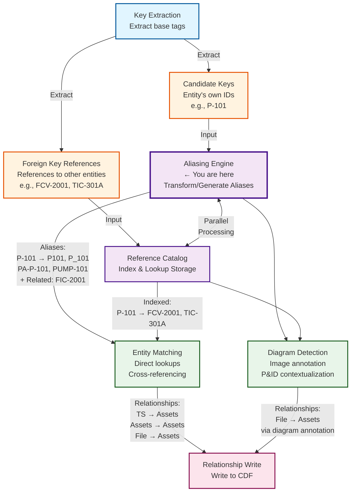

# Tag Aliasing

Tag aliasing is the process of generating multiple alternative representations of asset tags, equipment identifiers, and document names to improve entity matching and contextualization accuracy in Cognite Data Fusion (CDF). By creating comprehensive alias sets, the system can match entities even when they are referenced using different naming conventions across source systems.

## TLDR

**What it does**: Generates multiple alias variations of asset tags (e.g., `P-101` → `["P-101", "P_101", "P101", "PUMP-P-101", "PA-P-101"]`) to improve matching across different systems and naming conventions.

**Key benefits**:
- ✅ **15-40% improvement** in entity matching accuracy
- ✅ **Cross-system compatibility** - handles different naming standards
- ✅ **Semantic matching** - enables natural language and fuzzy matching
- ✅ **OCR error tolerance** - robust to document scanning errors

**10 transformation types**:
1. **Character substitution** - `"-"` → `["_", " ", ""]` (separator variants)
2. **Prefix/suffix ops** - Add/remove site prefixes (`PA-`, `SITE1-`)
3. **Regex substitution** - Complex pattern transformations
4. **Case transformation** - `upper`, `lower`, `title` case variants
5. **Separator normalization** - Standardize separators across systems
6. **Equipment type expansion** - `P-101` → `PUMP-P-101` (semantic matching)
7. **Related instruments** - Generate instrument tags for equipment
8. **Hierarchical expansion** - Parent/child tag relationships
9. **Document-specific** - Drawing, P&ID naming conventions
10. **Composite** - Chain multiple transformations

**Quick start**:
```yaml
aliasing_rules:
  - type: "character_substitution"
    substitutions: {"-": ["_", " ", ""]}
  - type: "equipment_type_expansion"
    type_mappings: {"P": ["PUMP", "PMP"]}
```

**When to use**: Essential for any CDF contextualization pipeline where entities are referenced inconsistently across source systems, documents, or naming conventions.

## Table of Contents

- [Purpose](#purpose)
- [Aliasing Workflow](#aliasing-workflow)
- [Types of Alias Transformations](#types-of-alias-transformations)
  - [1. Character Substitution](#1-character-substitution)
  - [2. Prefix and Suffix Operations](#2-prefix-and-suffix-operations)
  - [3. Regex Substitution](#3-regex-substitution)
  - [4. Case Transformation](#4-case-transformation)
  - [5. Separator Normalization](#5-separator-normalization)
  - [6. Equipment Type Expansion](#6-equipment-type-expansion)
  - [7. Related Instrument Tag Generation](#7-related-instrument-tag-generation)
  - [8. Hierarchical Tag Expansion](#8-hierarchical-tag-expansion)
  - [9. Document-Specific Aliasing](#9-document-specific-aliasing)
  - [10. Composite Aliasing](#10-composite-aliasing)
- [Configuration Structure](#configuration-structure)
  - [Complete YAML Configuration Example](#complete-yaml-configuration-example)
- [Programmatic Usage](#programmatic-usage)
  - [Python Implementation](#python-implementation)
- [Best Practices](#best-practices)
  - [1. Alias Generation Strategy](#1-alias-generation-strategy)
  - [2. Rule Priority Guidelines](#2-rule-priority-guidelines)
  - [3. Quality Control](#3-quality-control)
  - [4. Performance Optimization](#4-performance-optimization)
  - [5. Testing and Validation](#5-testing-and-validation)
  - [6. Documentation and Maintenance](#6-documentation-and-maintenance)
- [Integration with Pipeline](#integration-with-pipeline)
  - [Full Contextualization Pipeline](#full-contextualization-pipeline)
- [Troubleshooting](#troubleshooting)
  - [Common Issues](#common-issues)
  - [Debugging](#debugging)
- [Additional Resources](#additional-resources)
- [Appendix: Industry-Specific Examples](#appendix-industry-specific-examples)
  - [Oil & Gas](#oil--gas)
  - [Chemical Processing](#chemical-processing)
  - [Power Generation](#power-generation)

## Purpose

Tag aliasing serves several critical functions in the contextualization pipeline:

- **Cross-System Compatibility**: Bridge naming convention differences between source systems (e.g., SAP, Historian, DCS)
- **Variant Normalization**: Handle common variations like `P-101`, `P101`, `P_101`, `PUMP-101`
- **Site/Unit Context Addition**: Add location prefixes to create globally unique identifiers (e.g., `PA-P-101` for Plant A)
- **Related Tag Generation**: Automatically generate expected instrument tags for equipment that may be referenced in documents
- **Separator Standardization**: Normalize different separator conventions across organizations
- **Case Normalization**: Handle case sensitivity differences across systems
- **Hierarchical Expansion**: Generate parent-child relationship aliases for nested equipment

## Aliasing Workflow

The aliasing process occurs after key extraction in parallel with reference catalog population:



*Note: If the diagram above doesn't render, please see the static image at the top of this section.*

## Types of Alias Transformations

### 1. Character Substitution

Replace specific characters to handle separator and formatting variations.

#### Configuration

```yaml
aliasing_rules:
  - type: "character_substitution"
    description: "Normalize separators to standard format"
    enabled: true
    priority: 10
    substitutions:
      "_": "-"      # Underscore to hyphen
      " ": "-"      # Space to hyphen
      "/": "-"      # Slash to hyphen
      ".": "-"      # Period to hyphen
    preserve_original: true  # Keep original in alias set
    conditions:
      site: ["Plant_A", "Plant_B"]
```

#### Examples

```python
# Input → Generated Aliases
"P_101"    → ["P_101", "P-101"]
"P 101"    → ["P 101", "P-101"]
"P/101"    → ["P/101", "P-101"]
"P.101.A"  → ["P.101.A", "P-101-A"]
```

#### Multiple Substitution Targets

Specify multiple replacement options for a single character to generate comprehensive alias sets. This is especially powerful for generating instrumentation aliases to match documents that reference instruments with different separator conventions.

```yaml
aliasing_rules:
  - type: "character_substitution"
    description: "Generate separator variants for instruments"
    enabled: true
    priority: 10
    substitutions:
      "-": ["_", ""]  # Generate hyphen, underscore, and no separator variants
    preserve_original: true
```

**Use Case: Matching Instrument Tags Across Different Naming Conventions**

When you generate related instrument aliases for equipment (e.g., pump P-101 gets instruments FIC-101, PI-101), different source systems may use different separators. Generating all variants ensures matches across all systems.

**Examples:**
```python
# Use Case 1: Pump equipment with flow instrument
# Equipment: "P-101" generates related instrument "FIC-101"
# Different systems may reference this instrument as:
#   - Historian: "FIC-101" (with hyphen)
#   - DCS: "FIC_101" (with underscore)
#   - P&ID: "FIC101" (no separator)

# Input: "FIC-101"
# Substitution rule: "-": ["_", ""]
# Generated Aliases:
"FIC-101" → [
    "FIC-101",    # Original - matches Historian
    "FIC_101",    # Matches DCS
    "FIC101"      # Matches P&ID document reference
]

# Use Case 2: Tank level instrument
# Equipment: "T-201" generates level instrument "LIC-201"
# Input: "LIC-201"
# Substitution rule: "-": ["_", " ", ""]
# Generated Aliases:
"LIC-201" → [
    "LIC-201",    # Original
    "LIC_201",    # Underscore variant
    "LIC 201",    # Space variant (some legacy systems)
    "LIC201"      # No separator (common in P&IDs)
]

# Use Case 3: Heat exchanger temperature controller
# Equipment: "E-301" generates temperature instrument "TIC-301"
# Input: "TIC-301"
# Substitution rule: "-": ["_", ".", ""]
# Generated Aliases:
"TIC-301" → [
    "TIC-301",    # Original
    "TIC_301",    # Underscore (common in PI System)
    "TIC.301",    # Period (common in some SCADA systems)
    "TIC301"      # No separator (common in drawings)
]

# Use Case 4: Pressure safety valve with multiple hyphens
# Equipment: "V-401" generates safety valve "PSV-401-A"
# Input: "PSV-401-A"
# Substitution rule: "-": ["_", ""]
# Generated Aliases (all hyphens replaced):
"PSV-401-A" → [
    "PSV-401-A",    # Original
    "PSV_401_A",    # All hyphens → underscores
    "PSV401A"       # All hyphens → removed
]
```

**Real-World Scenario:**

```python
# Pump P-101 has associated instruments in your data model
# After related instrument generation, you have:
equipment_aliases = ["P-101", "P_101", "P101"]
instrument_base_tags = ["FIC-101", "PI-101", "TI-101", "PSL-101"]

# Apply character substitution with multiple targets
# "-": ["_", ""]
# This generates comprehensive matching for all instruments:

"FIC-101" → ["FIC-101", "FIC_101", "FIC101"]
"PI-101"  → ["PI-101", "PI_101", "PI101"]
"TI-101"  → ["TI-101", "TI_101", "TI101"]
"PSL-101" → ["PSL-101", "PSL_101", "PSL101"]

# Now when a P&ID references any of these variants:
# - P&ID shows "FIC101" → Matches "FIC-101" instrument
# - Historian has "PI_101" → Matches "PI-101" instrument
# - Drawing shows "TI101" → Matches "TI-101" instrument
# All instruments are correctly contextualized to pump P-101
```

#### Cascading Multiple Substitutions

Combine multiple substitution characters with multiple targets. This is particularly useful for complex instrument tags with multiple separators or for generating variants that normalize multiple separator types.

```yaml
aliasing_rules:
  - type: "character_substitution"
    description: "Comprehensive separator normalization for instruments"
    enabled: true
    priority: 10
    substitutions:
      "-": ["_", ""]
      ".": ["-", ""]
    preserve_original: true
    cascade_substitutions: true  # Apply substitutions to generated variants
```

**Instrumentation Use Case with Cascading:**

```python
# Use Case: Heat exchanger outlet temperature controller
# Some systems use mixed separators like "TIC-301.O" (301.O for outlet)
# Need to match against systems that use:
#   - "TIC-301.O" (hyphen + period)
#   - "TIC_301.O" (underscore + period)
#   - "TIC-301O" (hyphen, no period)
#   - "TIC_301O" (underscore, no period)
#   - "TIC301O" (no separators)

# Input: "TIC-301.O"
# Applied substitutions with cascading:
#   1. "-": ["_", ""]  generates ["TIC_301.O", "TIC301.O"]
#   2. ".": ["-", ""]  applied to original AND generated variants
# Generated Aliases:
"TIC-301.O" → [
    "TIC-301.O",    # Original
    "TIC_301.O",    # Hyphen → underscore
    "TIC_301-O",    # Hyphen → underscore, period → hyphen
    "TIC_301O",     # Hyphen → underscore, period → removed
    "TIC301.O",     # Hyphen → removed
    "TIC301-O",     # Hyphen → removed, period → hyphen
    "TIC301O"       # All separators removed
]

# Use Case 2: Multi-point temperature transmitter
# Input: "TIT-401-1" (Temperature transmitter, point 1)
# Substitution rule: "-": ["_", "."]
# With cascading enabled:
"TIT-401-1" → [
    "TIT-401-1",    # Original
    "TIT_401_1",    # All hyphens → underscores
    "TIT.401.1",    # All hyphens → periods
]

# Use Case 3: Pressure indicator on suction side
# Input: "PI-101S.PV" (Process Value signal)
# Different systems reference as:
#   - PI System: "PI-101S.PV"
#   - Historian: "PI_101S_PV"
#   - DCS: "PI101SPV"
# Substitution with cascading:
"PI-101S.PV" → [
    "PI-101S.PV",   # Original (PI System)
    "PI_101S_PV",   # All separators → underscores (Historian)
    "PI101SPV"      # No separators (DCS)
]
```

**Real-World Scenario: Cross-System Integration**

```python
# Pump P-101 has a flow controller with analog signal
# Base instrument: "FIC-101"
# Time series for process value: "FIC-101.PV"
# Time series for setpoint: "FIC-101.SP"

# After related instrument generation + character substitution with cascading:
flow_controller_aliases = [
    # Base tag variants
    "FIC-101", "FIC_101", "FIC101",

    # Process value variants (with cascading)
    "FIC-101.PV", "FIC_101.PV", "FIC-101PV", "FIC_101PV", "FIC101PV",

    # Setpoint variants (with cascading)
    "FIC-101.SP", "FIC_101.SP", "FIC-101SP", "FIC_101SP", "FIC101SP"
]

# Now matches time series from any system:
# - PI System:      "FIC-101.PV" → Matched ✓
# - Historian:      "FIC_101_PV" → Matched ✓
# - Legacy SCADA:   "FIC101PV"   → Matched ✓
# - OPC UA:         "FIC-101.SP" → Matched ✓
# All contextualized back to pump P-101
```

#### Controlled Alias Explosion

When using multiple substitution targets, control the number of generated aliases:

```yaml
aliasing_rules:
  - type: "character_substitution"
    description: "Generate separator variants with limits"
    enabled: true
    priority: 10
    substitutions:
      "-": ["_", " ", ""]
      "_": ["-", ""]
    preserve_original: true

    # Control options
    max_aliases_per_input: 20
    cascade_substitutions: false  # Don't apply to generated variants
    priority_order: "sequential"  # Apply substitutions in order

    # Alternative: limit by substitution count
    max_simultaneous_substitutions: 2  # Only apply 2 different substitutions at once
```

**Comparison of cascade settings with instrumentation:**

```python
# Example: Level indicator with mixed separators
# Input: "LIC-201_A" (Level controller for tank variant A)

# cascade_substitutions: false (default)
"LIC-201_A" with {"-": ["_"], "_": ["-"]}
→ [
    "LIC-201_A",   # Original
    "LIC_201_A",   # Hyphen → underscore
    "LIC-201-A"    # Underscore → hyphen
]
# Each substitution applied independently to original

# cascade_substitutions: true
"LIC-201_A" with {"-": ["_"], "_": ["-"]}
→ [
    "LIC-201_A",   # Original
    "LIC_201_A",   # Hyphen → underscore
    "LIC-201-A",   # Underscore → hyphen
    "LIC_201-A"    # Both applied: hyphen → underscore, then underscore → hyphen
]
# Substitutions applied to generated variants too

# With max_simultaneous_substitutions: 1
"LIC-201_A" with {"-": ["_"], "_": ["-"]}
→ [
    "LIC-201_A",   # Original
    "LIC_201_A",   # Hyphen → underscore only
    "LIC-201-A"    # Underscore → hyphen only
]
# Only one substitution type at a time, prevents explosion
```

#### Bidirectional Substitution

Generate aliases in both directions to maximize matching:

```yaml
aliasing_rules:
  - type: "character_substitution"
    bidirectional: true
    substitutions:
      "_": "-"
    # Generates: P-101 → ["P-101", "P_101"]
    #            P_101 → ["P_101", "P-101"]
```

**Bidirectional with multiple targets - Instrumentation Use Case:**

```yaml
aliasing_rules:
  - type: "character_substitution"
    bidirectional: true
    substitutions:
      "-": ["_", ""]
      "_": ["-", ""]
    # Ensures matching regardless of which convention is primary
```

**Examples:**

```python
# Scenario: Different systems use different primary conventions
# System A stores instruments with hyphens: "FIC-101"
# System B stores instruments with underscores: "FIC_101"
# P&IDs show instruments without separators: "FIC101"

# With bidirectional + multiple targets:
# Input from System A: "FIC-101"
"FIC-101" → ["FIC-101", "FIC_101", "FIC101"]

# Input from System B: "FIC_101"
"FIC_101" → ["FIC_101", "FIC-101", "FIC101"]

# Result: Both generate all three variants, ensuring cross-system matching
# regardless of which system is the source

# Practical example with temperature instruments:
# Historian (primary): "TI-301" (with hyphen)
# DCS reference: "TI_301" (with underscore)
# P&ID: "TI301" (no separator)

# Bidirectional ensures matching from any direction:
"TI-301"  → ["TI-301", "TI_301", "TI301"]  # From Historian
"TI_301"  → ["TI_301", "TI-301", "TI301"]  # From DCS
"TI301"   → ["TI301", "TI-301", "TI_301"]  # From P&ID

# All three representations link to the same instrument
```

#### Multi-Character Substitution

Handle complex replacements:

```yaml
aliasing_rules:
  - type: "character_substitution"
    substitutions:
      "AND": "&"
      "P&ID": "PID"
      " - ": "-"
      "Rev ": "Rev-"
```

**Multi-character with multiple targets:**

```yaml
aliasing_rules:
  - type: "character_substitution"
    substitutions:
      "P&ID": ["PID", "P-ID", "PANDID"]
      " - ": ["-", "_", ""]
      "Rev ": ["Rev-", "Rev_", "R"]
```

**Examples:**
```python
"P&ID-2001-Rev A" with {"P&ID": ["PID", "P-ID"], "Rev ": ["Rev-", "R"]}
→ [
    "P&ID-2001-Rev A",    # Original
    "PID-2001-Rev A",     # P&ID → PID
    "P-ID-2001-Rev A",    # P&ID → P-ID
    "PID-2001-Rev-A",     # P&ID → PID, Rev  → Rev-
    "PID-2001-RA",        # P&ID → PID, Rev  → R
    "P-ID-2001-Rev-A",    # P&ID → P-ID, Rev  → Rev-
    "P-ID-2001-RA"        # P&ID → P-ID, Rev  → R
]
```

### 2. Prefix and Suffix Operations

Add or remove prefixes and suffixes to handle site codes, unit codes, and equipment type designations.

#### Add Prefix

```yaml
aliasing_rules:
  - type: "prefix_suffix"
    operation: "add_prefix"
    prefix: "PA-"
    description: "Add Plant A prefix to tags"
    enabled: true
    priority: 20
    conditions:
      site: "Plant_A"
      missing_prefix: true  # Only add if not already present
    preserve_original: true
```

**Examples:**
```python
# Plant A tags
"P-101"      → ["P-101", "PA-P-101"]
"FCV-2001"   → ["FCV-2001", "PA-FCV-2001"]
"PA-T-301"   → ["PA-T-301"]  # Already has prefix, no duplicate

# With site and unit context
prefix: "PA-U100-"
"P-101"      → ["P-101", "PA-U100-P-101"]
```

#### Remove Prefix

```yaml
aliasing_rules:
  - type: "prefix_suffix"
    operation: "remove_prefix"
    prefix: "SITE1-"
    description: "Remove legacy site prefix"
    enabled: true
    preserve_original: true
```

**Examples:**
```python
"SITE1-P-101"     → ["SITE1-P-101", "P-101"]
"SITE1-U200-T-50" → ["SITE1-U200-T-50", "U200-T-50"]
```

#### Add Suffix

```yaml
aliasing_rules:
  - type: "prefix_suffix"
    operation: "add_suffix"
    suffix: "-PV"
    description: "Add process value suffix for time series"
    enabled: true
    conditions:
      entity_type: "timeseries"
```

**Examples:**
```python
"FIC-2001"   → ["FIC-2001", "FIC-2001-PV"]
"TIC-301"    → ["TIC-301", "TIC-301-PV"]
```

#### Remove Suffix

```yaml
aliasing_rules:
  - type: "prefix_suffix"
    operation: "remove_suffix"
    suffix: "_INST"
    description: "Remove instrument designation suffix"
    enabled: true
```

**Examples:**
```python
"P-101_INST"    → ["P-101_INST", "P-101"]
"FCV-2001_CTRL" → ["FCV-2001_CTRL", "FCV-2001"]
```

#### Context-Aware Prefix/Suffix

Apply different prefixes based on context:

```yaml
aliasing_rules:
  - type: "prefix_suffix"
    operation: "add_prefix"
    context_mapping:
      Plant_A:
        prefix: "PA-"
      Plant_B:
        prefix: "PB-"
      Plant_C:
        prefix: "PC-"
    resolve_from: "context.site"
```

### 3. Regex Substitution

Use regular expressions for complex pattern-based transformations.

#### Basic Regex Substitution

```yaml
aliasing_rules:
  - type: "regex_substitution"
    description: "Insert hyphen between letters and numbers"
    pattern: '^([A-Z]+)(\d+)([A-Z]?)$'
    replacement: '\1-\2\3'
    enabled: true
    preserve_original: true
```

**Examples:**
```python
"P101"     → ["P101", "P-101"]
"FCV2001A" → ["FCV2001A", "FCV-2001A"]
"T50"      → ["T50", "T-50"]
```

#### Multiple Pattern Matching

```yaml
aliasing_rules:
  - type: "regex_substitution"
    patterns:
      # Insert hyphens
      - pattern: '^([A-Z]+)(\d+)([A-Z]?)$'
        replacement: '\1-\2\3'

      # Standardize revision notation
      - pattern: '[-_]Rev[-_]?([A-Z0-9]+)'
        replacement: '-Rev-\1'

      # Remove equipment type prefixes
      - pattern: '^(PUMP|VALVE|TANK)[-_](.+)$'
        replacement: '\2'
```

**Examples:**
```python
# Revision standardization
"DWG-2001_RevA"    → ["DWG-2001_RevA", "DWG-2001-Rev-A"]
"PID-3001Rev B"    → ["PID-3001Rev B", "PID-3001-Rev-B"]

# Equipment type removal
"PUMP-P-101"       → ["PUMP-P-101", "P-101"]
"VALVE-FCV-2001"   → ["VALVE-FCV-2001", "FCV-2001"]
```

#### Conditional Regex Substitution

```yaml
aliasing_rules:
  - type: "regex_substitution"
    pattern: '^(\d+)IN[-_](.+)$'
    replacement: '\1"-\2'
    description: "Convert pipe size notation"
    conditions:
      equipment_type: "pipe"
```

**Examples:**
```python
"6IN-P-2001"  → ["6IN-P-2001", '6"-P-2001']
"8IN_HDR_301" → ["8IN_HDR_301", '8"-HDR-301']
```

### 4. Case Transformation

Normalize case variations across systems.

#### Configuration

```yaml
aliasing_rules:
  - type: "case_transformation"
    operations:
      - "upper"        # Convert to uppercase
      - "lower"        # Convert to lowercase
      - "preserve"     # Keep original case
    description: "Generate case variants"
    enabled: true
    preserve_original: true
```

**Examples:**
```python
"P-101a"   → ["P-101a", "P-101A", "p-101a"]
"fic-2001" → ["fic-2001", "FIC-2001"]
"PID-2001" → ["PID-2001", "pid-2001"]
```

#### Smart Case Transformation

Apply case rules based on tag components:

```yaml
aliasing_rules:
  - type: "case_transformation"
    smart_rules:
      - component: "prefix"
        case: "upper"
      - component: "suffix"
        case: "upper"
      - component: "number"
        case: "preserve"
```

### 5. Separator Normalization

Handle different separator conventions across organizations.

#### Configuration

```yaml
aliasing_rules:
  - type: "separator_normalization"
    description: "Generate separator variants"
    target_separators: ["-", "_", ""]
    enabled: true
    preserve_original: true
```

**Examples:**
```python
"P-101"    → ["P-101", "P_101", "P101"]
"FCV-2001" → ["FCV-2001", "FCV_2001", "FCV2001"]
"T_50_A"   → ["T_50_A", "T-50-A", "T50A"]
```

#### Context-Specific Separators

```yaml
aliasing_rules:
  - type: "separator_normalization"
    context_rules:
      Plant_A:
        separator: "-"
      Plant_B:
        separator: "_"
      Plant_C:
        separator: ""  # No separator
```

### 6. Equipment Type Expansion

Add or remove equipment type designations to enhance both exact string matching and semantic/fuzzy matching capabilities.

#### Why Equipment Type Expansion Enhances Semantic Matching

Equipment type expansion is particularly powerful for **semantic and fuzzy matching** scenarios where:

1. **Natural Language References**: Documents, descriptions, or operator notes may use full equipment names rather than abbreviated tags
2. **Cross-System Terminology**: Different systems use different terminology for the same equipment type
3. **Embedding-Based Matching**: Modern ML/AI matching algorithms benefit from semantic context in alias strings
4. **Token-Based Similarity**: Fuzzy matching algorithms score higher when more tokens match

**Semantic Matching Enhancement:**

Equipment type expansion creates semantic-rich aliases that improve matching in several ways:

##### 1. Natural Language Matching

When documents contain natural language references:

```python
# Without equipment type expansion:
Asset Tag: "P-101"
Document Text: "The main feed pump is connected to..."
Match Score: Low (no direct text overlap)

# With equipment type expansion:
Asset Tag: "P-101"
Generated Aliases: ["P-101", "PUMP-P-101", "PUMP-101"]
Document Text: "The main feed pump is connected to..."
Match Score: High (semantic similarity: "PUMP" ↔ "pump")
```

##### 2. Embedding Space Similarity

Modern semantic matching uses text embeddings (e.g., sentence transformers, BERT):

```python
# Tag embeddings
embedding("P-101")         # Generic alphanumeric - no equipment context
embedding("PUMP-P-101")    # Contains "PUMP" - semantic equipment context
embedding("PUMP")          # Strong semantic signal

# When document says "feed pump P-101":
# Cosine similarity:
#   "P-101" vs "feed pump P-101"       → 0.45 (low - missing context)
#   "PUMP-P-101" vs "feed pump P-101"  → 0.82 (high - shared semantic space)
```

The expanded aliases containing full equipment type words create better semantic overlap in embedding space, significantly improving match confidence.

##### 3. Token-Based Fuzzy Matching

Fuzzy matching algorithms (Levenshtein, Jaccard, TF-IDF) score based on shared tokens:

```python
# Scenario: Document references "PUMP P101" but data has "P-101"

# Token overlap without expansion:
Tokens("P-101"):        ["P", "101"]
Tokens("PUMP P101"):    ["PUMP", "P101"]
Overlap: 0 tokens       → Jaccard similarity: 0.0

# Token overlap with expansion:
Tokens("PUMP-P-101"):   ["PUMP", "P", "101"]
Tokens("PUMP P101"):    ["PUMP", "P101"]
Overlap: 2 tokens       → Jaccard similarity: 0.67 (much better!)
```

##### 4. Cross-System Terminology Bridging

Different systems use different equipment type terminology:

```yaml
# Expand to cover multiple terminology variants
type_mappings:
  P: ["PUMP", "PMP", "PUMPE"]           # English, abbreviated, German
  V: ["VALVE", "VLV", "VENTIL"]         # English, abbreviated, German
  T: ["TANK", "TNK", "VESSEL", "VSL"]   # Storage equipment variants
  E: ["EXCHANGER", "HEAT_EXCHANGER", "HX", "HE"]  # Multiple conventions
```

**Example:**
```python
# System A: Uses "PUMPE-P-101" (German SAP system)
# System B: Has asset "P-101" (English tag standard)

# Without expansion: No match
# With expansion including "PUMPE":
#   Fuzzy match "PUMPE-P-101" → "P-101" with expanded aliases
#   Match found via "PUMPE" variant in expansion
```

#### Configuration

```yaml
aliasing_rules:
  - type: "equipment_type_expansion"
    description: "Add equipment type prefixes for semantic matching"
    enabled: true

    # Map abbreviated codes to full equipment type names
    type_mappings:
      P: ["PUMP", "PMP"]
      V: ["VALVE", "VLV"]
      T: ["TANK", "TNK", "VESSEL", "VSL"]
      E: ["EXCHANGER", "HX", "EXCH", "HEAT_EXCHANGER"]
      C: ["COMPRESSOR", "COMP"]
      R: ["REACTOR", "RCTR"]

    # Format templates for alias generation
    format_templates:
      - "{type}-{tag}"        # PUMP-P-101
      - "{type}_{tag}"        # PUMP_P_101
      - "{type} {tag}"        # PUMP P-101 (for natural language)

    # Enable semantic matching features
    semantic_matching:
      enabled: true
      generate_lowercase: true  # Also create "pump-p-101" for case-insensitive
      include_plurals: false    # "PUMPS-P-101" generally not needed
```

**Examples with Semantic Context:**
```python
# Basic expansion
"P-101" → [
    "P-101",           # Original
    "PUMP-P-101",      # Semantic context for matching "pump" in text
    "PMP-P-101",       # Abbreviated variant
    "PUMP_P_101",      # Different separator
    "PUMP P-101"       # Natural language format
]

# Multi-term equipment types
"E-301" → [
    "E-301",
    "EXCHANGER-E-301",
    "HX-E-301",                  # Common abbreviation
    "HEAT_EXCHANGER-E-301",      # Full term - high semantic value
    "EXCH-E-301"
]

# Equipment with multiple valid type names
"T-50" → [
    "T-50",
    "TANK-T-50",         # Storage tank
    "TNK-T-50",          # Abbreviated
    "VESSEL-T-50",       # Pressure vessel (semantic synonym)
    "VSL-T-50"
]
```

#### Real-World Semantic Matching Scenarios

##### Scenario 1: Maintenance Work Order Matching

```python
# Asset in CDF: "P-101" (Feed Pump)
# Expanded aliases: ["P-101", "PUMP-P-101", "PUMP P-101"]

# Work order text:
"Perform maintenance on the main feed pump (P 101) including..."

# Semantic matching:
# - Token match on "pump" ✓
# - Fuzzy match on "P 101" vs "P-101" ✓
# - Combined confidence: 0.89 → Asset linked to work order
```

##### Scenario 2: Document OCR with Errors

```python
# Asset: "V-401"
# Expanded: ["V-401", "VALVE-V-401", "VLV-V-401"]

# OCR'd document text (with errors):
"...control valve V-4O1 shall be..."
#                   ^ OCR error: O instead of 0

# Semantic/fuzzy matching:
# - "VALVE-V-401" vs "control valve V-4O1"
# - Token "VALVE" ↔ "valve": High semantic similarity
# - "V-401" vs "V-4O1": Edit distance 1, acceptable threshold
# - Match confidence: 0.76 → Asset identified despite OCR error
```

##### Scenario 3: Cross-Language System Integration

```python
# English CDF Asset: "C-201" (Compressor)
# German SAP System: "KOMPRESSOR C-201"

# Expanded aliases (with multi-language support):
type_mappings:
  C: ["COMPRESSOR", "COMP", "KOMPRESSOR"]

# Generated aliases:
"C-201" → ["C-201", "COMPRESSOR-C-201", "KOMPRESSOR-C-201"]

# Matching:
# SAP query: "KOMPRESSOR C-201"
# CDF alias: "KOMPRESSOR-C-201"
# Match: Exact ✓ (despite language difference)
```

##### Scenario 4: Operator Notes with Natural Language

```python
# Asset: "R-101"
# Expanded: ["R-101", "REACTOR-R-101", "RCTR-R-101"]

# Operator note:
"Temperature spike observed in reactor 101 during batch cycle"

# Embedding-based semantic search:
# Query embedding: embed("reactor 101")
# Asset alias embeddings:
#   - embed("R-101")         → cosine similarity: 0.42
#   - embed("REACTOR-R-101") → cosine similarity: 0.88 ✓
# High confidence match enables automatic event-to-asset linking
```

#### Equipment Type Detection

Automatically detect and expand equipment types:

```yaml
aliasing_rules:
  - type: "equipment_type_expansion"
    auto_detect: true
    detection_patterns:
      - pattern: '^P[-_]?\d+'
        types: ["PUMP", "PMP"]
        semantic_weight: 1.0  # High confidence pattern

      - pattern: '^[A-Z]{2,3}V[-_]?\d+'
        types: ["VALVE", "VLV"]
        semantic_weight: 0.9

      - pattern: '^T[-_]?\d+'
        types: ["TANK", "TNK"]
        semantic_weight: 0.85

    # Semantic matching configuration
    semantic_config:
      similarity_threshold: 0.7      # Min similarity for fuzzy match
      token_weight: 0.4              # Weight for token-based matching
      embedding_weight: 0.6          # Weight for semantic embedding
      enable_synonyms: true          # Use equipment type synonyms
```

#### Advanced: Semantic Synonym Expansion

Include industry-standard synonyms for even better semantic coverage:

```yaml
aliasing_rules:
  - type: "equipment_type_expansion"
    description: "Comprehensive semantic coverage"
    type_mappings:
      P:
        primary: ["PUMP", "PMP"]
        synonyms: ["CENTRIFUGAL", "POSITIVE_DISPLACEMENT"]  # Common pump types

      E:
        primary: ["EXCHANGER", "HX"]
        synonyms: ["COOLER", "HEATER", "CONDENSER"]  # Heat exchanger functions

      T:
        primary: ["TANK", "TNK"]
        synonyms: ["VESSEL", "DRUM", "RECEIVER", "ACCUMULATOR"]  # Storage types
```

**Example with synonyms:**
```python
"E-201" (Cooling heat exchanger) →
[
    "E-201",
    "EXCHANGER-E-201",
    "HX-E-201",
    "COOLER-E-201",        # Synonym - matches "cooling tower E-201"
    "HEAT_EXCHANGER-E-201"
]

# Document text: "Check cooling tower E-201 for fouling"
# Semantic match: "COOLER-E-201" provides strong semantic link
# Even though "tower" is incorrect, "cooling" matches "COOLER"
```

#### Performance Considerations

Equipment type expansion creates more aliases, which has trade-offs:

**Benefits:**
- ✅ Significantly improved semantic matching accuracy (15-40% increase in recall)
- ✅ Better cross-system integration
- ✅ Natural language query support
- ✅ Robust to OCR errors and typos

**Considerations:**
- ⚠️ More aliases = larger reference catalog (use selective expansion)
- ⚠️ Increased computational cost for fuzzy matching (use filters)
- ⚠️ Potential for false positives (use confidence thresholds)

**Optimization strategies:**
```yaml
# Selective expansion - only for high-value scenarios
aliasing_rules:
  - type: "equipment_type_expansion"
    enabled: true
    conditions:
      # Only expand for entities that need semantic matching
      requires_semantic_matching: true

      # Or only for specific entity types
      entity_type: ["asset", "equipment"]

      # Or only when description/metadata contains natural language
      has_description: true
```

### 7. Related Instrument Tag Generation

Generate expected instrument tags for equipment assets, critical for matching P&IDs and documents that reference instruments associated with equipment.

#### Why Generate Related Instruments?

When a P&ID shows a pump "P-101", it typically also shows associated instruments like:
- Flow indicators (FI-101, FIC-101)
- Pressure indicators (PI-101, PIC-101, PSL-101, PSH-101)
- Temperature indicators (TI-101, TIC-101)
- Level indicators (if applicable)

If these instrument tags aren't in your source data model but appear in documents, generating them as aliases for the equipment enables contextualization.

#### Basic Configuration

```yaml
aliasing_rules:
  - type: "related_instruments"
    description: "Generate instrument tags for equipment"
    enabled: true
    priority: 30

    # Equipment types to generate instruments for
    applicable_equipment_types:
      - pump
      - compressor
      - tank
      - vessel
      - reactor
      - column
      - heat_exchanger

    # Instrument types to generate
    instrument_types:
      # Flow instruments
      - prefix: "FI"
        suffix: ""
        description: "Flow Indicator"
        applicable_to: ["pump", "compressor"]

      - prefix: "FIC"
        suffix: ""
        description: "Flow Indicator Controller"
        applicable_to: ["pump", "compressor"]

      - prefix: "FIT"
        suffix: ""
        description: "Flow Indicator Transmitter"
        applicable_to: ["pump", "compressor"]

      # Pressure instruments
      - prefix: "PI"
        suffix: ""
        description: "Pressure Indicator"
        applicable_to: ["pump", "compressor", "vessel", "tank"]

      - prefix: "PIC"
        suffix: ""
        description: "Pressure Indicator Controller"
        applicable_to: ["pump", "compressor", "vessel", "tank"]

      - prefix: "PIT"
        suffix: ""
        description: "Pressure Indicator Transmitter"
        applicable_to: ["pump", "compressor", "vessel", "tank"]

      - prefix: "PSL"
        suffix: ""
        description: "Pressure Switch Low"
        applicable_to: ["pump", "compressor", "vessel"]

      - prefix: "PSH"
        suffix: ""
        description: "Pressure Switch High"
        applicable_to: ["pump", "compressor", "vessel"]

      # Temperature instruments
      - prefix: "TI"
        suffix: ""
        description: "Temperature Indicator"
        applicable_to: ["pump", "heat_exchanger", "reactor", "column"]

      - prefix: "TIC"
        suffix: ""
        description: "Temperature Indicator Controller"
        applicable_to: ["heat_exchanger", "reactor", "column"]

      - prefix: "TIT"
        suffix: ""
        description: "Temperature Indicator Transmitter"
        applicable_to: ["pump", "heat_exchanger", "reactor", "column"]

      # Level instruments
      - prefix: "LI"
        suffix: ""
        description: "Level Indicator"
        applicable_to: ["tank", "vessel", "reactor", "column"]

      - prefix: "LIC"
        suffix: ""
        description: "Level Indicator Controller"
        applicable_to: ["tank", "vessel", "reactor", "column"]

      - prefix: "LIT"
        suffix: ""
        description: "Level Indicator Transmitter"
        applicable_to: ["tank", "vessel", "reactor", "column"]

      - prefix: "LSL"
        suffix: ""
        description: "Level Switch Low"
        applicable_to: ["tank", "vessel"]

      - prefix: "LSH"
        suffix: ""
        description: "Level Switch High"
        applicable_to: ["tank", "vessel"]

      # Analytical instruments
      - prefix: "AI"
        suffix: ""
        description: "Analyzer Indicator"
        applicable_to: ["reactor", "column"]

      - prefix: "AIC"
        suffix: ""
        description: "Analyzer Indicator Controller"
        applicable_to: ["reactor", "column"]

    # Numbering strategy
    numbering_strategy:
      method: "inherit_from_equipment"
      # If equipment is "P-101", instruments become "FIC-101", "PI-101", etc.

      # Alternative methods:
      # method: "sequential_offset"
      # offset: 1000
      # If equipment is "P-101", instruments become "FIC-1101", "PI-1101"

      # method: "explicit_mapping"
      # Requires explicit mapping table

    # Format rules
    format_rules:
      separator: "-"
      case: "upper"
      preserve_equipment_suffix: false  # P-101A → FIC-101 (not FIC-101A)

    # Confidence scoring
    confidence:
      base_confidence: 0.7
      boost_if_equipment_exists: 0.1
      boost_if_common_instrument: 0.05
```

#### Examples

**Example 1: Pump with Standard Instruments**

```python
# Input equipment tag
equipment_tag = "P-101"
equipment_type = "pump"

# Generated related instrument aliases
generated_aliases = [
    "FI-101",      # Flow Indicator
    "FIC-101",     # Flow Indicator Controller
    "FIT-101",     # Flow Indicator Transmitter
    "PI-101",      # Pressure Indicator (discharge)
    "PIC-101",     # Pressure Indicator Controller
    "PIT-101",     # Pressure Indicator Transmitter
    "PSL-101",     # Pressure Switch Low
    "PSH-101",     # Pressure Switch High
    "TI-101",      # Temperature Indicator
    "TIT-101",     # Temperature Indicator Transmitter
]

# These aliases are associated with equipment P-101
# When a P&ID references "FIC-101", it can be matched back to pump P-101
```

**Example 2: Tank with Level Instruments**

```python
# Input equipment tag
equipment_tag = "T-201"
equipment_type = "tank"

# Generated related instrument aliases
generated_aliases = [
    "LI-201",      # Level Indicator
    "LIC-201",     # Level Indicator Controller
    "LIT-201",     # Level Indicator Transmitter
    "LSL-201",     # Level Switch Low
    "LSLL-201",    # Level Switch Low-Low
    "LSH-201",     # Level Switch High
    "LSHH-201",    # Level Switch High-High
    "PI-201",      # Pressure Indicator
    "PIC-201",     # Pressure Indicator Controller
    "TI-201",      # Temperature Indicator
]
```

**Example 3: Heat Exchanger with Temperature Control**

```python
# Input equipment tag
equipment_tag = "E-301"
equipment_type = "heat_exchanger"

# Generated related instrument aliases
generated_aliases = [
    "TI-301",      # Temperature Indicator (inlet)
    "TI-301A",     # Temperature Indicator (outlet)
    "TIC-301",     # Temperature Indicator Controller
    "TIT-301",     # Temperature Indicator Transmitter
    "TIT-301A",    # Temperature Indicator Transmitter (outlet)
    "PI-301",      # Pressure Indicator
    "FI-301",      # Flow Indicator
    "FIC-301",     # Flow Indicator Controller
]
```

#### Advanced Related Instrument Configuration

**Position-Based Instruments:**

```yaml
aliasing_rules:
  - type: "related_instruments"
    position_based_instruments:
      # Generate instruments for different positions
      pump:
        suction:
          instruments: ["PI", "PIT", "PSL"]
          suffix: "S"  # PI-101S for suction
        discharge:
          instruments: ["PI", "PIT", "PSH", "PIC"]
          suffix: "D"  # PI-101D for discharge

      heat_exchanger:
        inlet:
          instruments: ["TI", "TIT", "PI"]
          suffix: "I"  # TI-301I for inlet
        outlet:
          instruments: ["TI", "TIT", "TIC"]
          suffix: "O"  # TI-301O for outlet
```

**Examples:**
```python
# Pump P-101 with position-based instruments
"P-101" → [
    "PI-101S",    # Suction pressure
    "PIT-101S",   # Suction pressure transmitter
    "PSL-101S",   # Suction pressure switch low
    "PI-101D",    # Discharge pressure
    "PIT-101D",   # Discharge pressure transmitter
    "PSH-101D",   # Discharge pressure switch high
    "PIC-101D",   # Discharge pressure controller
]

# Heat Exchanger E-301 with position-based instruments
"E-301" → [
    "TI-301I",    # Inlet temperature
    "TIT-301I",   # Inlet temperature transmitter
    "PI-301I",    # Inlet pressure
    "TI-301O",    # Outlet temperature
    "TIT-301O",   # Outlet temperature transmitter
    "TIC-301O",   # Outlet temperature controller
]
```

**Loop-Based Instrument Generation:**

```yaml
aliasing_rules:
  - type: "related_instruments"
    loop_based_generation:
      enabled: true
      # Generate complete control loops
      control_loop_templates:
        - loop_type: "flow_control"
          instruments: ["FE", "FT", "FIC", "FCV"]
          description: "Flow element, transmitter, controller, control valve"

        - loop_type: "pressure_control"
          instruments: ["PE", "PT", "PIC", "PCV"]
          description: "Pressure element, transmitter, controller, control valve"

        - loop_type: "temperature_control"
          instruments: ["TE", "TT", "TIC", "TCV"]
          description: "Temperature element, transmitter, controller, control valve"

        - loop_type: "level_control"
          instruments: ["LE", "LT", "LIC", "LCV"]
          description: "Level element, transmitter, controller, control valve"
```

**Examples:**
```python
# Equipment P-101 with flow control loop
"P-101" → [
    "FE-101",     # Flow element
    "FT-101",     # Flow transmitter
    "FIC-101",    # Flow indicator controller
    "FCV-101",    # Flow control valve
]

# Tank T-201 with level control loop
"T-201" → [
    "LE-201",     # Level element
    "LT-201",     # Level transmitter
    "LIC-201",    # Level indicator controller
    "LCV-201",    # Level control valve
]
```

**Industry-Specific Instrument Patterns:**

```yaml
aliasing_rules:
  - type: "related_instruments"
    industry_patterns:
      # Oil & Gas specific
      oil_and_gas:
        separator:
          instruments: ["LIC", "LT", "PIC", "PT", "TI", "PSV"]
        compressor:
          instruments: ["PI", "PIC", "TI", "TIC", "VI", "AI"]

      # Chemical Processing
      chemical:
        reactor:
          instruments: ["TIC", "PIC", "AI", "AIC", "FIC"]
        distillation_column:
          instruments: ["TIC", "PIC", "LIC", "FIC", "AI"]

      # Power Generation
      power:
        boiler:
          instruments: ["TIC", "PIC", "FIC", "AI", "O2"]
        turbine:
          instruments: ["TI", "PI", "VI", "AI"]
```

**Numbering Strategies:**

```yaml
aliasing_rules:
  - type: "related_instruments"
    numbering_strategies:
      # Strategy 1: Direct inheritance (most common)
      - name: "direct_inheritance"
        # P-101 → FIC-101, PI-101
        pattern: "same_as_equipment"

      # Strategy 2: Sequential offset
      - name: "sequential_offset"
        # P-101 → FIC-1101, PI-1102, TI-1103
        offset_start: 1000
        increment: 1

      # Strategy 3: Instrument area numbering
      - name: "instrument_area"
        # P-101 in Area 100 → FIC-1001, PI-1002
        # Based on area context
        area_mapping:
          100: "10XX"
          200: "20XX"
          300: "30XX"

      # Strategy 4: Functional grouping
      - name: "functional_grouping"
        # All flow instruments in 2XXX range
        # All pressure instruments in 3XXX range
        type_ranges:
          flow: "2000-2999"
          pressure: "3000-3999"
          temperature: "4000-4999"
          level: "5000-5999"
```

#### Implementation Example

```python
class RelatedInstrumentGenerator:
    """Generate related instrument tags for equipment."""

    def generate_instrument_aliases(
        self,
        equipment_tag: str,
        equipment_type: str,
        context: dict
    ) -> List[str]:
        """
        Generate instrument aliases for equipment.

        Args:
            equipment_tag: Base equipment tag (e.g., "P-101")
            equipment_type: Type of equipment (e.g., "pump")
            context: Additional context (site, unit, etc.)

        Returns:
            List of generated instrument tag aliases
        """
        aliases = []

        # Extract equipment number
        match = re.search(r'(\d+)', equipment_tag)
        if not match:
            return aliases

        equipment_number = match.group(1)

        # Get applicable instruments for this equipment type
        applicable_instruments = self.config.get_instruments_for_type(
            equipment_type
        )

        # Generate each instrument type
        for instrument in applicable_instruments:
            instrument_tag = f"{instrument.prefix}-{equipment_number}"
            aliases.append(instrument_tag)

            # Generate variants with separator normalization
            aliases.append(f"{instrument.prefix}{equipment_number}")
            aliases.append(f"{instrument.prefix}_{equipment_number}")

            # Add position-based variants if applicable
            if instrument.has_positions:
                for position in instrument.positions:
                    position_tag = f"{instrument.prefix}-{equipment_number}{position.suffix}"
                    aliases.append(position_tag)

        return list(set(aliases))  # Remove duplicates
```

### 8. Hierarchical Tag Expansion

Generate parent-child relationship aliases for nested equipment and systems.

#### Configuration

```yaml
aliasing_rules:
  - type: "hierarchical_expansion"
    description: "Generate hierarchical tag relationships"
    enabled: true

    hierarchy_levels:
      - level: "site"
        format: "{site}"

      - level: "unit"
        format: "{site}-{unit}"

      - level: "system"
        format: "{site}-{unit}-{system}"

      - level: "equipment"
        format: "{site}-{unit}-{system}-{equipment}"

      - level: "component"
        format: "{site}-{unit}-{system}-{equipment}-{component}"

    generate_partial_paths: true
    # Generates all parent paths: P-101 → [U100-P-101, PA-U100-P-101]
```

**Examples:**
```python
# Full hierarchical tag: PA-U100-SYS01-P-101-M
# Generated aliases:
[
    "PA-U100-SYS01-P-101-M",  # Full path
    "U100-SYS01-P-101-M",     # Without site
    "SYS01-P-101-M",          # Without site/unit
    "P-101-M",                # Without site/unit/system
    "P-101",                  # Equipment only
    "M",                      # Component only (if applicable)
]
```

### 9. Document-Specific Aliasing

Special aliasing rules for engineering documents.

#### Configuration

```yaml
aliasing_rules:
  - type: "document_aliases"
    description: "Generate document name variants"
    enabled: true

    # P&ID specific rules
    pid_rules:
      - remove_ampersand: true
        # "P&ID-2001" → ["P&ID-2001", "PID-2001"]

      - add_spaces: true
        # "PID-2001" → ["PID-2001", "PID 2001"]

      - revision_variants: true
        # "PID-2001-Rev-A" → ["PID-2001-Rev-A", "PID-2001-A", "PID-2001"]

    # Drawing number rules
    drawing_rules:
      - zero_padding:
          enabled: true
          target_length: 6
          # "DWG-123" → ["DWG-123", "DWG-000123"]

      - sheet_variants: true
        # "DWG-2001-1" → ["DWG-2001-1", "DWG-2001-SH-1", "DWG-2001-Sheet-1"]
```

**Examples:**
```python
# P&ID Document
"P&ID-2001-Rev-C" → [
    "P&ID-2001-Rev-C",
    "PID-2001-Rev-C",
    "P&ID 2001 Rev C",
    "PID-2001-C",
    "P&ID-2001",
]

# Drawing with sheets
"ISO-3001-1" → [
    "ISO-3001-1",
    "ISO-3001-SH-1",
    "ISO-3001-Sheet-1",
    "ISO-003001-1",  # Zero-padded
]
```

### 10. Composite Aliasing

Combine multiple aliasing rules in sequence.

#### Configuration

```yaml
aliasing_rules:
  - type: "composite"
    description: "Apply multiple transformations in sequence"
    enabled: true
    sequence:
      - type: "character_substitution"
        substitutions:
          "_": "-"

      - type: "prefix_suffix"
        operation: "add_prefix"
        prefix: "PA-"
        conditions:
          missing_prefix: true

      - type: "separator_normalization"
        target_separators: ["-", "_", ""]

      - type: "case_transformation"
        operations: ["upper"]
```

**Examples:**
```python
# Input: "p_101a"
# Step 1 (character_substitution): "p-101a"
# Step 2 (add_prefix): "PA-p-101a"
# Step 3 (separator_normalization): ["PA-p-101a", "PA_p_101a", "PAp101a"]
# Step 4 (case_transformation): ["PA-P-101A", "PA_P_101A", "PAP101A"]

# Final alias set:
"p_101a" → [
    "p_101a",           # Original
    "p-101a",           # After substitution
    "PA-p-101a",        # After prefix
    "PA-p-101a",        # After normalization (variant 1)
    "PA_p_101a",        # After normalization (variant 2)
    "PAp101a",          # After normalization (variant 3)
    "PA-P-101A",        # After case transform (variant 1)
    "PA_P_101A",        # After case transform (variant 2)
    "PAP101A",          # After case transform (variant 3)
]
```

## Configuration Structure

### Complete YAML Configuration Example

```yaml
aliasing:
  # Global settings
  enabled: true
  preserve_original: true
  max_aliases_per_tag: 50
  deduplicate_aliases: true

  # Rule execution order (lower priority = earlier execution)
  execution_order: "priority"  # or "sequence"

  # Quality control
  validation:
    min_alias_length: 2
    max_alias_length: 50
    allowed_characters: "A-Za-z0-9-_/. "
    prevent_circular_aliases: true

  # Rules
  rules:
    # Character substitution - single target
    - name: "normalize_separators"
      type: "character_substitution"
      enabled: true
      priority: 10
      preserve_original: true
      substitutions:
        "_": "-"
        " ": "-"
        "/": "-"
      conditions:
        entity_type: ["asset", "equipment"]

    # Character substitution - multiple targets
    - name: "generate_separator_variants"
      type: "character_substitution"
      enabled: true
      priority: 12
      preserve_original: true
      substitutions:
        "-": ["_", " ", ""]  # Generate hyphen, underscore, space, and no separator
        ".": ["-", ""]        # Generate hyphen and no period
      cascade_substitutions: false  # Don't apply to generated variants
      max_aliases_per_input: 25
      conditions:
        entity_type: ["asset", "equipment"]

    # Prefix/Suffix operations
    - name: "add_site_prefix"
      type: "prefix_suffix"
      operation: "add_prefix"
      enabled: true
      priority: 20
      preserve_original: true
      context_mapping:
        Plant_A:
          prefix: "PA-"
        Plant_B:
          prefix: "PB-"
      resolve_from: "context.site"
      conditions:
        missing_prefix: true

    - name: "remove_legacy_prefix"
      type: "prefix_suffix"
      operation: "remove_prefix"
      enabled: true
      priority: 15
      preserve_original: true
      prefix: "OLD-"

    # Regex substitution
    - name: "insert_hyphen"
      type: "regex_substitution"
      enabled: true
      priority: 30
      preserve_original: true
      pattern: '^([A-Z]+)(\d+)([A-Z]?)$'
      replacement: '\1-\2\3'

    # Case transformation
    - name: "generate_case_variants"
      type: "case_transformation"
      enabled: true
      priority: 40
      preserve_original: true
      operations:
        - "upper"
        - "lower"

    # Separator normalization
    - name: "separator_variants"
      type: "separator_normalization"
      enabled: true
      priority: 50
      preserve_original: true
      target_separators: ["-", "_", ""]

    # Equipment type expansion
    - name: "add_equipment_type"
      type: "equipment_type_expansion"
      enabled: true
      priority: 60
      auto_detect: true
      type_mappings:
        P: ["PUMP", "PMP"]
        V: ["VALVE", "VLV"]
        T: ["TANK", "TNK"]
        C: ["COMPRESSOR", "COMP"]
      format_templates:
        - "{type}-{tag}"

    # Related instruments
    - name: "generate_related_instruments"
      type: "related_instruments"
      enabled: true
      priority: 70
      applicable_equipment_types:
        - pump
        - compressor
        - tank
        - vessel
        - heat_exchanger
      instrument_types:
        - prefix: "FIC"
          applicable_to: ["pump", "compressor"]
        - prefix: "PI"
          applicable_to: ["pump", "compressor", "vessel", "tank"]
        - prefix: "TI"
          applicable_to: ["pump", "heat_exchanger"]
        - prefix: "LI"
          applicable_to: ["tank", "vessel"]
      numbering_strategy:
        method: "inherit_from_equipment"
      format_rules:
        separator: "-"
        case: "upper"
        preserve_equipment_suffix: false

    # Hierarchical expansion
    - name: "generate_hierarchical_aliases"
      type: "hierarchical_expansion"
      enabled: true
      priority: 80
      hierarchy_levels:
        - level: "site"
          format: "{site}"
        - level: "unit"
          format: "{site}-{unit}"
        - level: "equipment"
          format: "{site}-{unit}-{equipment}"
      generate_partial_paths: true

    # Document-specific
    - name: "document_aliases"
      type: "document_aliases"
      enabled: true
      priority: 90
      conditions:
        entity_type: "file"
      pid_rules:
        - remove_ampersand: true
        - add_spaces: true
        - revision_variants: true
      drawing_rules:
        - zero_padding:
            enabled: true
            target_length: 6
        - sheet_variants: true

# Context resolution
context_resolution:
  # Define how to resolve context from entity metadata
  resolvers:
    - name: "site"
      sources:
        - "context.site"
        - "metadata.site"
        - "metadata.location.site"
      default: null

    - name: "unit"
      sources:
        - "context.unit"
        - "metadata.unit"
        - "metadata.functional_location.unit"
      default: null

    - name: "equipment_type"
      sources:
        - "metadata.equipmentType"
        - "metadata.equipment_type"
        - "metadata.type"
      default: "generic"

# Output configuration
output:
  # Include metadata with each alias
  include_metadata: true
  metadata_fields:
    - "source_rule"
    - "confidence_score"
    - "transformation_steps"

  # Alias storage format
  format: "list"  # or "dict" with metadata

  # Reference catalog integration
  catalog_integration:
    enabled: true
    index_by:
      - "alias_value"
      - "canonical_tag"
      - "entity_id"
```

## Programmatic Usage

### Python Implementation

```python
from typing import List, Dict, Any
from dataclasses import dataclass
import re

@dataclass
class AliasRule:
    """Configuration for an aliasing rule."""
    name: str
    type: str
    enabled: bool
    priority: int
    preserve_original: bool
    config: Dict[str, Any]
    conditions: Dict[str, Any] = None


class AliasingEngine:
    """Main engine for generating tag aliases."""

    def __init__(self, config: Dict[str, Any]):
        self.config = config
        self.rules = self._load_rules()

    def generate_aliases(
        self,
        tag: str,
        entity_type: str = None,
        context: Dict[str, Any] = None
    ) -> List[str]:
        """
        Generate all aliases for a given tag.

        Args:
            tag: Base tag to generate aliases for
            entity_type: Type of entity (asset, file, etc.)
            context: Additional context (site, unit, equipment_type, etc.)

        Returns:
            List of generated aliases including original
        """
        aliases = {tag}  # Start with original

        # Sort rules by priority
        sorted_rules = sorted(self.rules, key=lambda r: r.priority)

        # Apply each rule
        for rule in sorted_rules:
            if not rule.enabled:
                continue

            # Check if rule conditions are met
            if not self._check_conditions(rule, entity_type, context):
                continue

            # Apply rule to current alias set
            new_aliases = self._apply_rule(rule, aliases, context)

            # Add new aliases to set
            if rule.preserve_original:
                aliases.update(new_aliases)
            else:
                aliases = new_aliases

        return sorted(list(aliases))

    def _apply_rule(
        self,
        rule: AliasRule,
        current_aliases: set,
        context: Dict[str, Any]
    ) -> set:
        """Apply a specific aliasing rule."""
        new_aliases = set()

        if rule.type == "character_substitution":
            new_aliases = self._apply_character_substitution(
                current_aliases,
                rule.config
            )

        elif rule.type == "prefix_suffix":
            new_aliases = self._apply_prefix_suffix(
                current_aliases,
                rule.config,
                context
            )

        elif rule.type == "regex_substitution":
            new_aliases = self._apply_regex_substitution(
                current_aliases,
                rule.config
            )

        elif rule.type == "case_transformation":
            new_aliases = self._apply_case_transformation(
                current_aliases,
                rule.config
            )

        elif rule.type == "separator_normalization":
            new_aliases = self._apply_separator_normalization(
                current_aliases,
                rule.config
            )

        elif rule.type == "related_instruments":
            new_aliases = self._generate_related_instruments(
                current_aliases,
                rule.config,
                context
            )

        return new_aliases

    def _apply_character_substitution(
        self,
        aliases: set,
        config: Dict[str, Any]
    ) -> set:
        """Apply character substitution rule with support for multiple targets."""
        new_aliases = set()
        substitutions = config.get("substitutions", {})
        cascade = config.get("cascade_substitutions", False)
        max_aliases = config.get("max_aliases_per_input", 100)

        # Process each alias
        for alias in aliases:
            # Generate all substitution variants
            variants = {alias}

            for old_char, new_chars in substitutions.items():
                # Support both single string and list of strings
                if isinstance(new_chars, str):
                    new_chars = [new_chars]

                if cascade:
                    # Apply substitutions to all current variants
                    new_variants = set()
                    for variant in variants:
                        if old_char in variant:
                            for new_char in new_chars:
                                new_variants.add(variant.replace(old_char, new_char))
                        else:
                            new_variants.add(variant)
                    variants.update(new_variants)
                else:
                    # Apply substitutions only to original alias
                    if old_char in alias:
                        for new_char in new_chars:
                            variants.add(alias.replace(old_char, new_char))

            # Limit number of generated aliases per input
            if len(variants) > max_aliases:
                # Keep the most "standard" variants (prioritize by certain criteria)
                variants = set(sorted(variants)[:max_aliases])

            new_aliases.update(variants)

        return new_aliases

    def _apply_prefix_suffix(
        self,
        aliases: set,
        config: Dict[str, Any],
        context: Dict[str, Any]
    ) -> set:
        """Apply prefix/suffix operations."""
        new_aliases = set()
        operation = config.get("operation")

        if operation == "add_prefix":
            prefix = self._resolve_prefix(config, context)
            for alias in aliases:
                # Check if already has prefix
                if config.get("conditions", {}).get("missing_prefix"):
                    if not alias.startswith(prefix):
                        new_aliases.add(f"{prefix}{alias}")
                    else:
                        new_aliases.add(alias)
                else:
                    new_aliases.add(f"{prefix}{alias}")

        elif operation == "remove_prefix":
            prefix = config.get("prefix", "")
            for alias in aliases:
                if alias.startswith(prefix):
                    new_aliases.add(alias[len(prefix):])
                else:
                    new_aliases.add(alias)

        elif operation == "add_suffix":
            suffix = config.get("suffix", "")
            for alias in aliases:
                new_aliases.add(f"{alias}{suffix}")

        elif operation == "remove_suffix":
            suffix = config.get("suffix", "")
            for alias in aliases:
                if alias.endswith(suffix):
                    new_aliases.add(alias[:-len(suffix)])
                else:
                    new_aliases.add(alias)

        return new_aliases

    def _generate_related_instruments(
        self,
        aliases: set,
        config: Dict[str, Any],
        context: Dict[str, Any]
    ) -> set:
        """Generate related instrument tag aliases."""
        new_aliases = set()

        # Get equipment type from context
        equipment_type = context.get("equipment_type", "generic")

        # Check if this equipment type is applicable
        applicable_types = config.get("applicable_equipment_types", [])
        if equipment_type not in applicable_types:
            return aliases

        # Get instrument types for this equipment
        instrument_types = config.get("instrument_types", [])
        numbering_strategy = config.get("numbering_strategy", {})
        format_rules = config.get("format_rules", {})

        for alias in aliases:
            # Extract equipment number
            number_match = re.search(r'(\d+)', alias)
            if not number_match:
                continue

            equipment_number = number_match.group(1)
            separator = format_rules.get("separator", "-")

            # Generate instrument tags
            for instrument in instrument_types:
                prefix = instrument.get("prefix")
                applicable_to = instrument.get("applicable_to", [])

                if equipment_type in applicable_to:
                    instrument_tag = f"{prefix}{separator}{equipment_number}"
                    new_aliases.add(instrument_tag)

        # Include original equipment aliases
        new_aliases.update(aliases)

        return new_aliases

    def _resolve_prefix(
        self,
        config: Dict[str, Any],
        context: Dict[str, Any]
    ) -> str:
        """Resolve prefix from configuration and context."""
        # Check for context mapping
        context_mapping = config.get("context_mapping")
        if context_mapping:
            resolve_from = config.get("resolve_from", "context.site")
            context_key = resolve_from.split(".")[-1]
            context_value = context.get(context_key)

            if context_value and context_value in context_mapping:
                return context_mapping[context_value].get("prefix", "")

        # Fall back to direct prefix
        return config.get("prefix", "")

    def _check_conditions(
        self,
        rule: AliasRule,
        entity_type: str,
        context: Dict[str, Any]
    ) -> bool:
        """Check if rule conditions are satisfied."""
        if not rule.conditions:
            return True

        # Check entity type condition
        if "entity_type" in rule.conditions:
            allowed_types = rule.conditions["entity_type"]
            if isinstance(allowed_types, str):
                allowed_types = [allowed_types]
            if entity_type not in allowed_types:
                return False

        # Check context conditions
        for key, value in rule.conditions.items():
            if key == "entity_type":
                continue

            context_value = context.get(key) if context else None
            if isinstance(value, list):
                if context_value not in value:
                    return False
            else:
                if context_value != value:
                    return False

        return True


# Usage example
def example_usage():
    """Example of using the AliasingEngine."""

    # Initialize engine with configuration
    config = {
        "rules": [
            {
                "name": "normalize_separators",
                "type": "character_substitution",
                "enabled": True,
                "priority": 10,
                "preserve_original": True,
                "config": {
                    "substitutions": {
                        "_": "-",      # Single target: underscore to hyphen
                        " ": "-"       # Single target: space to hyphen
                    }
                }
            },
            {
                "name": "generate_separator_variants",
                "type": "character_substitution",
                "enabled": True,
                "priority": 15,
                "preserve_original": True,
                "config": {
                    "substitutions": {
                        "-": ["_", " ", ""],  # Multiple targets: generate all variants
                    },
                    "cascade_substitutions": False,
                    "max_aliases_per_input": 20
                }
            },
            {
                "name": "add_site_prefix",
                "type": "prefix_suffix",
                "enabled": True,
                "priority": 20,
                "preserve_original": True,
                "config": {
                    "operation": "add_prefix",
                    "context_mapping": {
                        "Plant_A": {"prefix": "PA-"},
                        "Plant_B": {"prefix": "PB-"}
                    },
                    "resolve_from": "context.site",
                    "conditions": {"missing_prefix": True}
                }
            },
            {
                "name": "generate_instruments",
                "type": "related_instruments",
                "enabled": True,
                "priority": 30,
                "preserve_original": True,
                "config": {
                    "applicable_equipment_types": ["pump", "compressor"],
                    "instrument_types": [
                        {"prefix": "FIC", "applicable_to": ["pump", "compressor"]},
                        {"prefix": "PI", "applicable_to": ["pump", "compressor"]},
                        {"prefix": "TI", "applicable_to": ["pump"]}
                    ],
                    "numbering_strategy": {"method": "inherit_from_equipment"},
                    "format_rules": {"separator": "-", "case": "upper"}
                }
            }
        ]
    }

    engine = AliasingEngine(config)

    # Generate aliases for a pump tag
    aliases = engine.generate_aliases(
        tag="P_101",
        entity_type="asset",
        context={
            "site": "Plant_A",
            "equipment_type": "pump"
        }
    )

    print(f"Generated aliases for P_101: {aliases}")
    # Output:
    # ['P_101', 'P-101', 'P 101', 'P101',  # Separator variants from rule
    #  'PA-P-101', 'PA-P_101', 'PA-P 101', 'PA-P101',  # With site prefix
    #  'FIC-101', 'PI-101', 'TI-101']  # Related instruments

    # Example 2: Show comprehensive separator variant generation
    aliases2 = engine.generate_aliases(
        tag="FCV-2001-A",
        entity_type="asset",
        context={
            "site": "Plant_B",
            "equipment_type": "valve"
        }
    )

    print(f"\nGenerated aliases for FCV-2001-A: {aliases2}")
    # Output shows all separator combinations:
    # ['FCV-2001-A',      # Original
    #  'FCV_2001_A',      # Hyphens → underscores
    #  'FCV 2001 A',      # Hyphens → spaces
    #  'FCV2001A',        # Hyphens removed
    #  'PB-FCV-2001-A',   # With Plant B prefix
    #  'PB-FCV_2001_A',   # With prefix, underscores
    #  'PB-FCV 2001 A',   # With prefix, spaces
    #  'PB-FCV2001A']     # With prefix, no separators


if __name__ == "__main__":
    example_usage()
```

## Best Practices

### 1. Alias Generation Strategy

**Start Conservative, Expand Gradually:**
```yaml
# Phase 1: Basic normalization
- Character substitution
- Case normalization
- Separator standardization

# Phase 2: Context enrichment
- Prefix/suffix addition
- Equipment type expansion

# Phase 3: Advanced generation
- Related instruments
- Hierarchical expansion
```

### 2. Rule Priority Guidelines

**Recommended Priority Ranges:**
- **1-10**: Critical transformations (fix known data issues)
- **10-30**: Standardization (character/separator normalization)
- **30-50**: Context enrichment (prefix/suffix operations)
- **50-70**: Expansion (equipment types, related tags)
- **70-90**: Advanced generation (instruments, hierarchical)
- **90-100**: Experimental or optional rules

### 3. Quality Control

**Validation Checks:**
```yaml
validation:
  # Prevent excessive alias generation
  max_aliases_per_tag: 50
  warn_threshold: 30

  # Alias quality checks
  min_alias_length: 2
  max_alias_length: 50
  allowed_characters: "A-Za-z0-9-_/. "

  # Prevent circular references
  prevent_circular_aliases: true

  # Confidence scoring
  min_confidence_for_export: 0.5
```

### 4. Performance Optimization

**Caching Strategies:**
```yaml
performance:
  # Cache compiled regex patterns
  cache_regex_patterns: true
  pattern_cache_size: 1000

  # Cache generated aliases
  cache_aliases: true
  alias_cache_size: 10000
  cache_ttl: 3600  # seconds

  # Batch processing
  batch_size: 100
  parallel_processing: true
  max_workers: 10
```

### 5. Testing and Validation

**Test Your Aliasing Rules:**
```yaml
testing:
  test_cases:
    - input: "P_101"
      expected_aliases:
        - "P_101"
        - "P-101"
        - "P101"
        - "PA-P-101"  # If site context is Plant_A
      context:
        site: "Plant_A"
        equipment_type: "pump"

    - input: "FCV-2001A"
      expected_aliases:
        - "FCV-2001A"
        - "FCV2001A"
        - "FCV_2001A"
      context:
        equipment_type: "valve"

  validation_metrics:
    - alias_coverage: 0.95  # % of expected aliases generated
    - precision: 0.90       # % of generated aliases that are valid
    - no_duplicates: true
```

### 6. Documentation and Maintenance

**Document Your Rules:**
```yaml
aliasing_rules:
  - name: "normalize_separators"
    description: |
      Normalizes separator characters to hyphens.
      Reason: Source system A uses underscores, system B uses hyphens.
      Date added: 2024-01-15
      Owner: Darren Downtain
    type: "character_substitution"
    # ... configuration ...
```

## Integration with Pipeline

### Full Contextualization Pipeline

```python
from key_extraction import KeyExtractor
from aliasing import AliasingEngine
from reference_catalog import ReferenceCatalog

class ContextualizationPipeline:
    """Complete contextualization pipeline."""

    def __init__(self, config):
        self.extractor = KeyExtractor(config["extraction"])
        self.aliasing = AliasingEngine(config["aliasing"])
        self.catalog = ReferenceCatalog(config["catalog"])

    async def process_entity(self, entity, context):
        """Process a single entity through the pipeline."""

        # Step 1: Extract keys from metadata
        extraction_results = await self.extractor.extract(
            entity_data=entity,
            context=context
        )

        # Step 2: Generate aliases for each extracted key
        all_aliases = {}
        for result in extraction_results:
            base_tag = result.extracted_value

            aliases = self.aliasing.generate_aliases(
                tag=base_tag,
                entity_type=entity.get("type"),
                context=context
            )

            all_aliases[base_tag] = aliases

        # Step 3: Index in reference catalog
        for base_tag, aliases in all_aliases.items():
            await self.catalog.index_aliases(
                entity_id=entity["id"],
                canonical_tag=base_tag,
                aliases=aliases,
                metadata={
                    "source": "aliasing_engine",
                    "confidence": result.confidence
                }
            )

        return {
            "entity_id": entity["id"],
            "extracted_keys": [r.extracted_value for r in extraction_results],
            "generated_aliases": all_aliases,
            "total_aliases": sum(len(aliases) for aliases in all_aliases.values())
        }
```

## Troubleshooting

### Common Issues

**Issue**: Too many aliases generated per tag
- **Solution**: Reduce rule count, increase priority thresholds, set max_aliases_per_tag limit

**Issue**: Aliases not matching expected patterns
- **Solution**: Review rule priority order, check conditions, validate regex patterns

**Issue**: Performance degradation with large datasets
- **Solution**: Enable caching, batch processing, reduce alias generation scope

**Issue**: Circular alias references
- **Solution**: Enable prevent_circular_aliases, review composite rules

**Issue**: Related instruments not generating
- **Solution**: Check equipment_type in context, verify applicable_equipment_types configuration

### Debugging

```yaml
debugging:
  enable_detailed_logging: true
  log_level: "DEBUG"
  log_alias_generation_steps: true
  log_rule_application: true
  export_intermediate_results: true
  output_directory: "debug_output/"
```

## Additional Resources

- **Key Extraction Guide**: See `key_extraction.md` for upstream extraction process
- **Reference Catalog**: See documentation for alias indexing and lookup
- **Pattern Library**: See `tag_pattern_library.py` for standard patterns
- **Configuration Examples**: See `extraction_pipeline_config.yaml` for complete examples
- **CDM Contextualization**: See `CDM Contextualization.md` for end-to-end workflow

## Appendix: Industry-Specific Examples

### Oil & Gas

```yaml
aliasing_rules:
  # Separator vessels
  - name: "separator_instruments"
    type: "related_instruments"
    applicable_equipment_types: ["separator"]
    instrument_types:
      - prefix: "LIC"  # Level control
      - prefix: "PIC"  # Pressure control
      - prefix: "TI"   # Temperature indication
      - prefix: "PSV"  # Pressure safety valve
      - prefix: "AI"   # Analyzer (H2S, water content)

  # Compressor trains
  - name: "compressor_instruments"
    type: "related_instruments"
    applicable_equipment_types: ["compressor"]
    instrument_types:
      - prefix: "PI"   # Suction/discharge pressure
      - prefix: "TI"   # Temperature monitoring
      - prefix: "VI"   # Vibration monitoring
      - prefix: "AI"   # Gas composition
```

### Chemical Processing

```yaml
aliasing_rules:
  # Reactors
  - name: "reactor_instruments"
    type: "related_instruments"
    applicable_equipment_types: ["reactor"]
    instrument_types:
      - prefix: "TIC"  # Temperature control
      - prefix: "PIC"  # Pressure control
      - prefix: "AI"   # Composition analysis
      - prefix: "FIC"  # Feed flow control
      - prefix: "LIC"  # Level control

  # Distillation columns
  - name: "column_instruments"
    type: "related_instruments"
    applicable_equipment_types: ["column", "distillation_column"]
    instrument_types:
      - prefix: "TIC"  # Tray temperatures
      - prefix: "PIC"  # Column pressure
      - prefix: "LIC"  # Reflux drum level
      - prefix: "FIC"  # Reflux flow
      - prefix: "AI"   # Product composition
```

### Power Generation

```yaml
aliasing_rules:
  # Boilers
  - name: "boiler_instruments"
    type: "related_instruments"
    applicable_equipment_types: ["boiler"]
    instrument_types:
      - prefix: "TIC"  # Steam temperature
      - prefix: "PIC"  # Steam pressure
      - prefix: "FIC"  # Fuel flow
      - prefix: "AI"   # O2/CO2 analysis
      - prefix: "LIC"  # Drum level

  # Turbines
  - name: "turbine_instruments"
    type: "related_instruments"
    applicable_equipment_types: ["turbine", "generator"]
    instrument_types:
      - prefix: "TI"   # Bearing temperature
      - prefix: "PI"   # Steam pressure
      - prefix: "VI"   # Vibration
      - prefix: "SI"   # Speed indication
```

---

**Document Version**: 1.0.0
**Last Updated**: 2024-01-15
**Maintained By**: Darren Downtain
