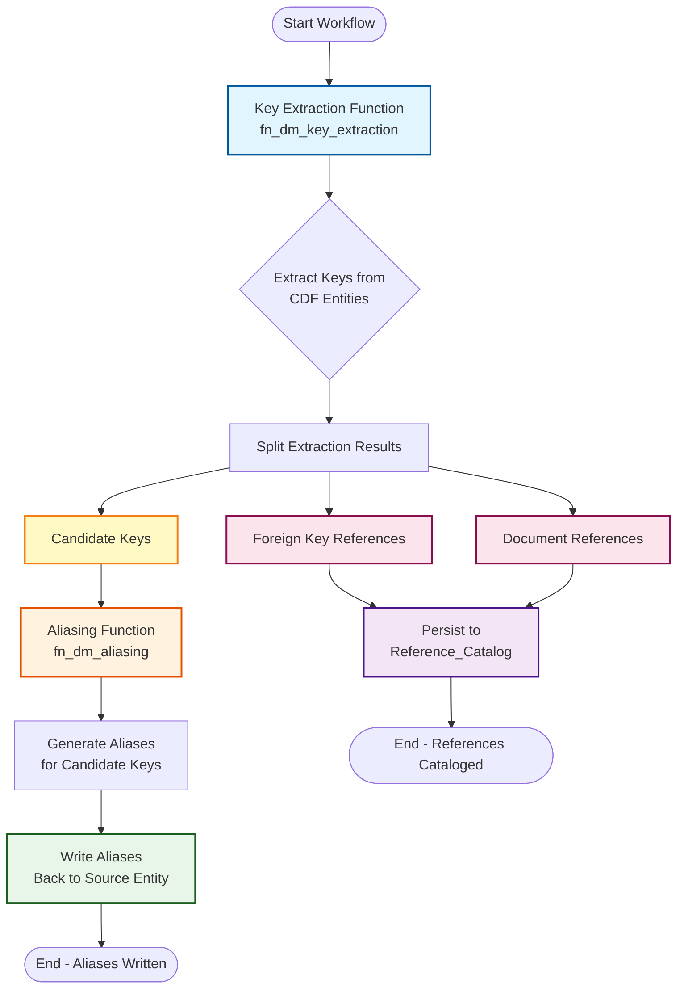

# Key Extraction and Aliasing Workflow

## Workflow Diagram


### Mermaid Source Code



## Detailed Flow Description

### 1. Key Extraction Phase
- **Component**: `fn_dm_key_extraction` CDF Function
- **Input**: CDF data model entities from configured source views
- **Process**:
  - Applies extraction rules (regex, fixed width, token reassembly, heuristic)
  - Extracts candidate keys, foreign key references, and document references
  - Validates and filters results by confidence
- **Output**: `ExtractionResult` containing:
  - `candidate_keys`: List of extracted candidate keys
  - `foreign_key_references`: List of foreign key references
  - `document_references`: List of document references

### 2. Result Splitting Phase
- **Component**: Workflow orchestration
- **Process**: Separates extraction results into three streams:
  - Candidate keys → Aliasing pipeline
  - Foreign key references → Reference catalog
  - Document references → Reference catalog

### 3. Aliasing Phase
- **Component**: `fn_dm_aliasing` CDF Function
- **Input**: Candidate keys from key extraction
- **Process**:
  - Generates aliases for each candidate key
  - Applies transformation rules (character substitution, prefix/suffix, etc.)
  - Uses ISA patterns for pattern-based expansion
  - Validates generated aliases
- **Output**: Aliases for each candidate key

### 4. Write Aliases Phase
- **Component**: Entity update process
- **Input**: Generated aliases for candidate keys
- **Process**:
  - Updates source entities with generated aliases
  - Links aliases to original candidate keys
  - Stores alias metadata
- **Output**: Updated entities with aliases persisted

### 5. Reference Catalog Phase
- **Component**: Reference_Catalog persistence
- **Input**: Foreign key references and document references
- **Process**:
  - Persists foreign key relationships
  - Catalogs document references
  - Creates cross-entity linkages
- **Output**: Populated Reference_Catalog

## Data Flow

```
Entities → Key Extraction → ExtractionResult
                              ├─ candidate_keys → Aliasing → Aliases → Write to Entity
                              ├─ foreign_key_references → Reference_Catalog
                              └─ document_references → Reference_Catalog
```

## Implementation Notes

### Current Workflow
The current `key_extraction_aliasing` workflow implements:
1. Key extraction task → extracts all key types
2. Aliasing task → automatically processes candidate keys from extraction results

### Recommended Enhancement
To fully implement the diagram:
1. Add a task to split results after key extraction
2. Add a task to persist foreign keys to Reference_Catalog
3. Add a task to persist document references to Reference_Catalog
4. Modify aliasing task to write aliases back to source entities

## Component Details

### Key Extraction Output Format
```python
ExtractionResult(
    entity_id: str,
    candidate_keys: List[ExtractedKey],      # → Aliasing
    foreign_key_references: List[ExtractedKey],  # → Reference_Catalog
    document_references: List[ExtractedKey]      # → Reference_Catalog
)
```

### Aliasing Output Format
```python
AliasingResult(
    original_tag: str,  # Candidate key value
    aliases: List[str],  # Generated aliases
    metadata: Dict      # Alias metadata
)
```

---

**Diagram Version**: 1.0
**Last Updated**: Based on current workflow implementation
